# Problem 1

# Investigating the Range as a Function of the Angle of Projection

## Theoretical Foundation

We begin by considering the motion of a projectile under the influence of gravity. The motion in both the horizontal and vertical directions can be described using the following equations:

### Equations of Motion

For a projectile launched with an initial velocity \( v_0 \) at an angle \( \theta \) to the horizontal, we can break the velocity into horizontal and vertical components:

- Horizontal velocity component: 
  $$ v_{0x} = v_0 \cos(\theta) $$

- Vertical velocity component: 
  $$ v_{0y} = v_0 \sin(\theta) $$

The equations of motion in the horizontal (\(x\)) and vertical (\(y\)) directions are given by:

1. Horizontal motion:
   $$ x(t) = v_{0x} t = v_0 \cos(\theta) t $$

2. Vertical motion:
   $$ y(t) = v_{0y} t - \frac{1}{2} g t^2 = v_0 \sin(\theta) t - \frac{1}{2} g t^2 $$

Where:
- \( g \) is the acceleration due to gravity
- \( t \) is the time of flight

### Time of Flight

To find the time of flight \( T \), we set the vertical displacement \( y(t) \) equal to zero when the projectile lands:

$$ 0 = v_0 \sin(\theta) T - \frac{1}{2} g T^2 $$

Solving for \( T \), we get:

$$ T = \frac{2 v_0 \sin(\theta)}{g} $$

### Range of the Projectile

The range \( R \) is the horizontal distance the projectile travels before landing. Using the time of flight \( T \), the range can be determined from the horizontal motion equation:

$$ R = x(T) = v_0 \cos(\theta) T $$

Substituting the expression for \( T \):

$$ R = v_0 \cos(\theta) \cdot \frac{2 v_0 \sin(\theta)}{g} $$

Simplifying the expression for the range:

$$ R = \frac{v_0^2 \sin(2\theta)}{g} $$

### Variations with Initial Conditions

As the angle \( \theta \) changes, the range of the projectile also changes. The sine function \( \sin(2\theta) \) shows how the range is maximized at an angle of \( 45^\circ \), where the value of \( \sin(2\theta) \) is 1.

Thus, the range is a function of the launch angle \( \theta \), initial velocity \( v_0 \), and gravity \( g \). Variations in any of these initial conditions lead to a family of solutions for the range, allowing us to analyze how changes in conditions affect projectile motion.

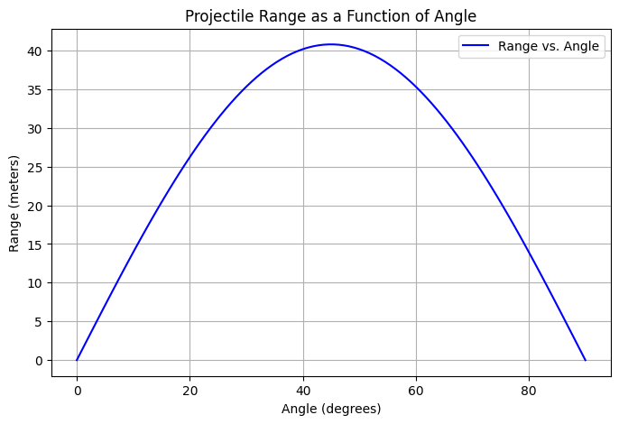 

## Analysis of the Range:

# Investigating the Range as a Function of the Angle of Projection

## Analysis of the Range

### Dependence of Range on the Angle of Projection

From the previous derivation, we know the range \( R \) of the projectile is given by the equation:

$$ R = \frac{v_0^2 \sin(2\theta)}{g} $$

Where:
- \( v_0 \) is the initial velocity
- \( \theta \) is the angle of projection
- \( g \) is the acceleration due to gravity

We can analyze the behavior of the range as a function of the angle of projection \( \theta \).

The term \( \sin(2\theta) \) in the range equation indicates that the range varies as a sinusoidal function of \( 2\theta \). The sine function reaches its maximum value of 1 when \( 2\theta = 90^\circ \), i.e., when \( \theta = 45^\circ \). Therefore, the maximum horizontal range is achieved when the angle of projection is \( 45^\circ \).

The relationship between the range and the angle of projection is symmetric. For angles greater than \( 45^\circ \), the range decreases as the sine function decreases after reaching its maximum. For angles less than \( 45^\circ \), the range also decreases as the angle moves further away from \( 45^\circ \).

Thus, the range is maximized when \( \theta = 45^\circ \), and for other angles, the range decreases symmetrically on either side of this optimal angle.

### Influence of Initial Velocity

The range \( R \) is directly proportional to the square of the initial velocity \( v_0 \):

$$ R \propto v_0^2 $$

This means that if the initial velocity \( v_0 \) is increased, the range of the projectile increases as well. For example, doubling the initial velocity would quadruple the range, assuming the angle of projection and gravitational acceleration remain constant.

### Influence of Gravitational Acceleration

The range \( R \) is inversely proportional to the acceleration due to gravity \( g \):

$$ R \propto \frac{1}{g} $$

This means that in regions with lower gravitational acceleration (e.g., on the Moon compared to Earth), the range of the projectile would be greater. If the gravitational acceleration \( g \) is decreased, the range increases, assuming all other factors remain constant.

### Combined Effect of Parameters

The horizontal range depends on the combined effects of the initial velocity, the angle of projection, and gravitational acceleration. The optimal angle for the maximum range is \( 45^\circ \), but the exact range achieved also depends on how large the initial velocity \( v_0 \) is and how small the gravitational acceleration \( g \) is. 

In summary:
- The range is maximized at \( \theta = 45^\circ \).
- A higher initial velocity increases the range.
- A lower gravitational acceleration increases the range.

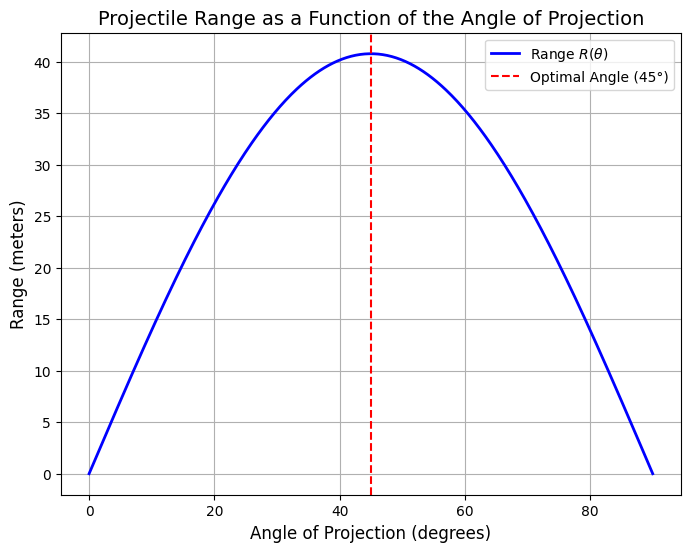   

## Practical Applications

### Projectiles on Uneven Terrain

The model derived for projectile motion assumes a flat horizontal surface, where the projectile lands at the same height from which it was launched. However, in real-world scenarios, projectiles are often launched on uneven terrain, such as hilly or sloped surfaces. In these cases, the range calculation becomes more complex.

To adapt the model for uneven terrain, we need to account for the change in height between the launch point and the landing point. The range equation must be modified to include the initial and final vertical displacements. The general form of the equation in the presence of a slope (with angle \( \alpha \)) is:

$$ y(t) = v_0 \sin(\theta) t - \frac{1}{2} g t^2 $$

Where the final vertical displacement \( y(t) \) will equal the slope height \( h \), and we would solve for \( t \) and the corresponding range.

In this case, numerical methods or simulations are often employed to solve for the time of flight and range, as the equation becomes nonlinear due to the varying terrain height.

### Air Resistance

In reality, air resistance plays a significant role in the motion of projectiles, especially at high velocities. Air resistance acts against the motion of the projectile, slowing it down in both the horizontal and vertical directions. This introduces a non-conservative force, and the equations of motion must be modified accordingly.

The force due to air resistance is typically modeled as:

$$ F_{\text{drag}} = \frac{1}{2} C_d \rho A v^2 $$

Where:
- \( C_d \) is the drag coefficient (dependent on the shape of the object),
- \( \rho \) is the air density,
- \( A \) is the cross-sectional area of the projectile,
- \( v \) is the velocity of the projectile.

To account for air resistance, the motion equations must be solved using the following system of differential equations:

1. Horizontal direction: 
   $$ m \frac{d^2 x}{dt^2} = -\frac{1}{2} C_d \rho A v \frac{dx}{dt} $$

2. Vertical direction:
   $$ m \frac{d^2 y}{dt^2} = -mg - \frac{1}{2} C_d \rho A v \frac{dy}{dt} $$

Here, \( v = \sqrt{\left(\frac{dx}{dt}\right)^2 + \left(\frac{dy}{dt}\right)^2} \) represents the velocity magnitude.

Incorporating air resistance requires numerical methods, such as Euler's method or Runge-Kutta methods, to solve these coupled differential equations. This makes the problem significantly more complex but provides a more accurate model of projectile motion in the real world.

### Practical Considerations

- **Accuracy of the Model**: In practical applications, adjustments for air resistance and terrain are crucial to making accurate predictions. In engineering, for example, understanding these factors is essential for designing projectiles, missiles, or sports equipment.
- **Applications in Sports**: In sports such as basketball, soccer, or golf, understanding projectile motion with air resistance is crucial to predicting ball trajectories and optimizing performance.
- **Military and Aerospace Engineering**: The design of artillery, missiles, and space missions often requires accounting for air resistance and uneven terrain, especially when the projectiles travel at high speeds and long distances.

### Conclusion

While the simple model for projectile motion offers a good starting point for understanding the relationship between launch angle and range, real-world applications require more complex models. Factors such as uneven terrain and air resistance significantly influence projectile motion, and these effects must be carefully considered in practical scenarios.

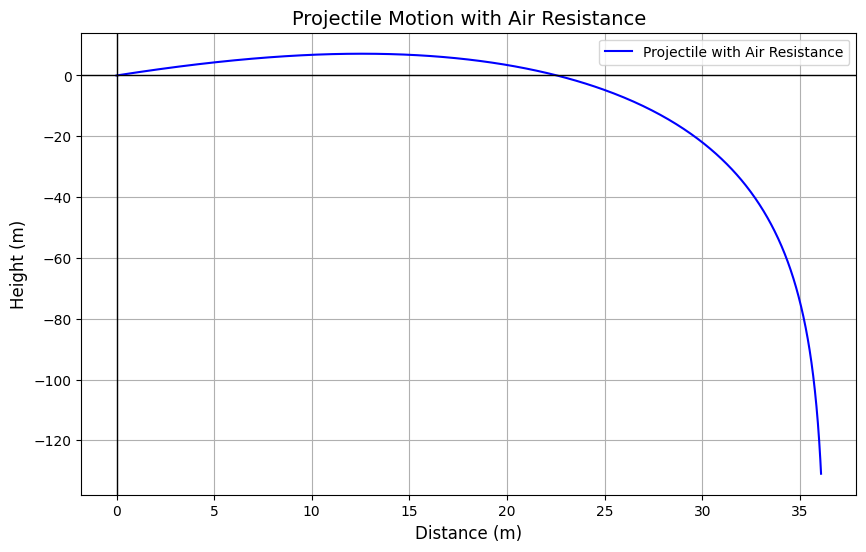

## Theoretical Foundation

Projectile motion is the motion of an object thrown into the air with an initial velocity, affected only by the forces of gravity and air resistance. The range of a projectile depends on various factors, most notably the angle of projection, initial velocity, and gravitational acceleration.

The horizontal range \( R \) of a projectile launched from the ground level is given by the equation:

$$
R = \frac{v_0^2 \sin(2\theta)}{g}
$$

Where:
- \( R \) = Range of the projectile (horizontal distance traveled).
- \( v_0 \) = Initial velocity.
- \( \theta \) = Angle of projection with the horizontal.
- \( g \) = Gravitational acceleration (approximately \( 9.81 \, \text{m/s}^2 \)).

The angle \( \theta \) is a key variable affecting the range. The range is maximized when the angle is \( 45^\circ \).
n

## Theoretical Foundation

Projectile motion is the motion of an object thrown into the air with an initial velocity, affected only by the forces of gravity and air resistance. The range of a projectile depends on various factors, most notably the angle of projection, initial velocity, and gravitational acceleration.

The horizontal range \( R \) of a projectile launched from the ground level is given by the equation:

$$
R = \frac{v_0^2 \sin(2\theta)}{g}
$$

Where:
- \( R \) = Range of the projectile (horizontal distance traveled).
- \( v_0 \) = Initial velocity.
- \( \theta \) = Angle of projection with the horizontal.
- \( g \) = Gravitational acceleration (approximately \( 9.81 \, \text{m/s}^2 \)).

The angle \( \theta \) is a key variable affecting the range. The range is maximized when the angle is \( 45^\circ \).

## Implementation

To simulate the projectile motion and visualize the range as a function of the angle of projection, we can use a computational tool that solves the equations of motion under different initial conditions.

### Steps for Implementation:

1. **Initial Conditions**: Define the initial velocity \( v_0 \) and vary the launch angles \( \theta \).
2. **Equations of Motion**: Use the equations of motion to calculate the trajectory:
   - \( x(t) = v_0 \cos(\theta) t \)
   - \( y(t) = v_0 \sin(\theta) t - \frac{1}{2} g t^2 \)
3. **Range Calculation**: The range is the horizontal distance traveled when \( y(t) = 0 \).
4. **Visualization**: For different values of \( \theta \), compute the range and plot the results.

### Mathematical Equations

- Horizontal velocity component: 
  $$
  v_{0x} = v_0 \cos(\theta)
  $$

- Vertical velocity component:
  $$
  v_{0y} = v_0 \sin(\theta)
  $$

- Time of flight: 
  $$
  t = \frac{2v_0 \sin(\theta)}{g}
  $$

- Horizontal range:
  $$
  R = v_{0x} \cdot t = \frac{v_0^2 \sin(2\theta)}{g}
  $$

## Computational Algorithm

To simulate the motion, we can use numerical integration methods to solve the differential equations of motion:

1. **Solve for the position** as a function of time:
   - \( x(t) \) and \( y(t) \).
   
2. **Iterate for different launch angles** to compute the range \( R(\theta) \).

# Investigating the Range as a Function of the Angle of Projection

## 1. Theoretical Foundation

We begin by deriving the governing equations of motion from fundamental principles. This involves solving a basic differential equation to establish the general form of the motion. Highlight how variations in initial conditions lead to a family of solutions.

**Equations of motion:**

For a projectile launched with an initial speed \( v_0 \) at an angle \( \theta \), the equations of motion are:

- Horizontal motion: 

$$ 
x(t) = v_0 \cdot \cos(\theta) \cdot t 
$$

- Vertical motion: 

$$ 
y(t) = v_0 \cdot \sin(\theta) \cdot t - \frac{1}{2}gt^2 
$$

To find the time of flight, set \( y(t) = 0 \) and solve for \( t \) (ignoring the trivial \( t=0 \) solution):

$$ 
t = \frac{2v_0 \cdot \sin(\theta)}{g} 
$$

Then, the range \( R \) becomes:
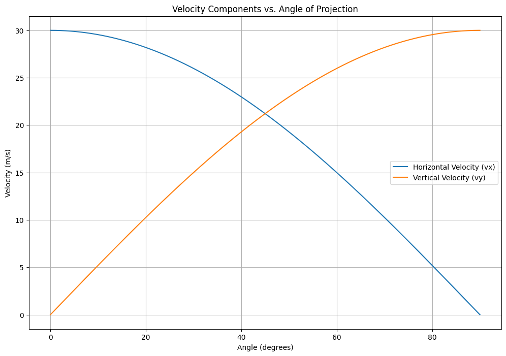
$$ 
R = v_0 \cdot \cos(\theta) \cdot \frac{2v_0 \cdot \sin(\theta)}{g} = \frac{v_0^2 \cdot \sin(2\theta)}{g} 
$$

This shows that the range is maximal when \( \theta = 45^\circ \).

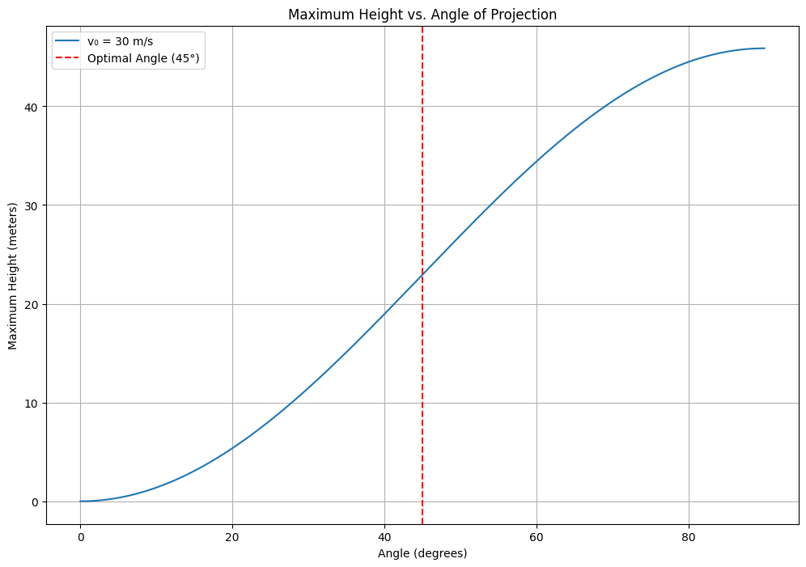

## 2. Analysis of the Range

We explore how the range \( R \) changes with angle \( \theta \), keeping \( v_0 \) and \( g \) constant. The function \( \sin(2\theta) \) drives the behavior of \( R \).

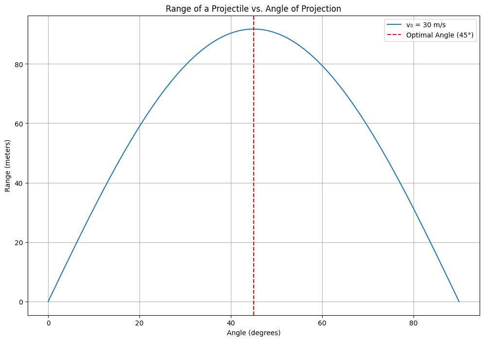

### Explanation of the Code

1. **Libraries Used:**
   - `numpy`: For numerical operations, especially for handling arrays and trigonometric functions.

2. **Constants:**
   - `v0`: Initial velocity of the projectile. Set to 30 m/s.
   - `g`: Acceleration due to gravity. Standard value is 9.81 m/s².

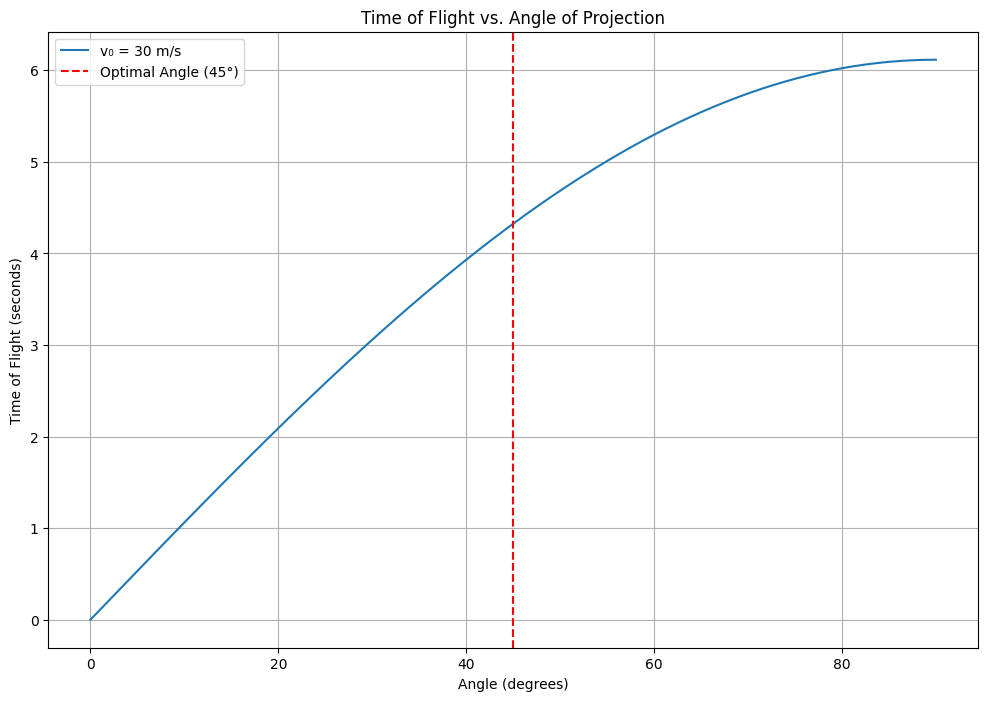

3. **Angle Calculation:**
   - `angles`: An array of angles from 0 to 90 degrees, divided into 500 points for smooth calculation.
   - `theta_rad`: Conversion of angles from degrees to radians, as trigonometric functions in Python use radians.

4. **Range Calculation:**
   - The range \( R \) is calculated using the formula

   

$$ 
R = \frac{v_0^2 \cdot \sin(2\theta)}{g} 
$$

5. **Output:**
   - The code prints the range for each angle, showing how the range changes with the angle of projection.

## 3. Practical Applications

This model can be adapted for:
- Launching projectiles from elevated platforms (non-zero initial height),
- Uneven terrains,
- Including drag force,
- Sports like football or golf,
- Military or aerospace applications.

## 4. Limitations and Extensions

**Limitations:**
- No air resistance,
- Flat terrain,
- Constant gravity,
- Point mass assumption.

**Extensions:**
- Add air resistance using numerical simulation,
- Vary gravity (e.g., on other planets),
- Include wind effects.

## 📌 Conclusion

The range depends heavily on the angle and initial velocity. The theoretical model is elegant and reveals that a \( 45^\circ \) launch gives the maximum range on flat ground with no air resistance. Real-world factors, however, often shift this optimal angle.

   # Practical Applications
   
## 1. Introduction

The theoretical model of projectile motion provides a foundation for understanding how objects move through space when launched at an angle. While the basic model assumes ideal conditions, such as no air resistance and flat terrain, real-world applications often require adaptations to account for more complex scenarios.

## 2. Adapting the Model

### Uneven Terrain

In many real-world situations, projectiles are launched over uneven terrain. This requires modifications to the basic model to account for changes in elevation. For example, if a projectile is launched from a hill or towards a target at a different height, the equations of motion must be adjusted to include initial and final vertical positions.

- **Equation Modification:** The vertical motion equation can be modified to include initial and final heights:

  $$
  y(t) = y_0 + v_0 \cdot \sin(\theta) \cdot t - \frac{1}{2}gt^2
  $$

  where \( y_0 \) is the initial height.

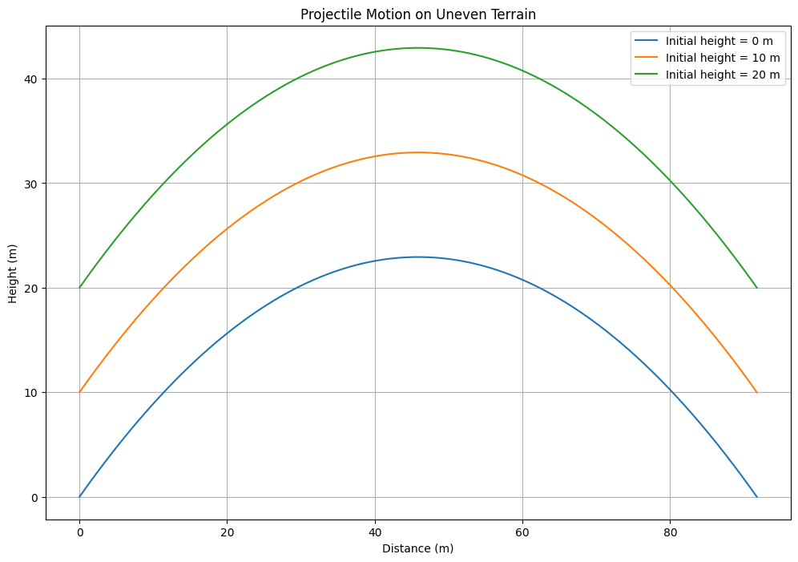

### Air Resistance

Air resistance is a significant factor in projectile motion, especially for objects moving at high speeds or over long distances. The presence of air resistance introduces a drag force that opposes the motion of the projectile, reducing its range and altering its trajectory.

- **Drag Force:** The drag force can be modeled as proportional to the velocity of the projectile, often using a quadratic relationship:

  $$
  F_d = -c \cdot v^2
  $$

  where \( c \) is the drag coefficient and \( v \) is the velocity.

- **Numerical Simulation:** Incorporating air resistance into the model typically requires numerical methods to solve the resulting differential equations, as they become too complex for analytical solutions.

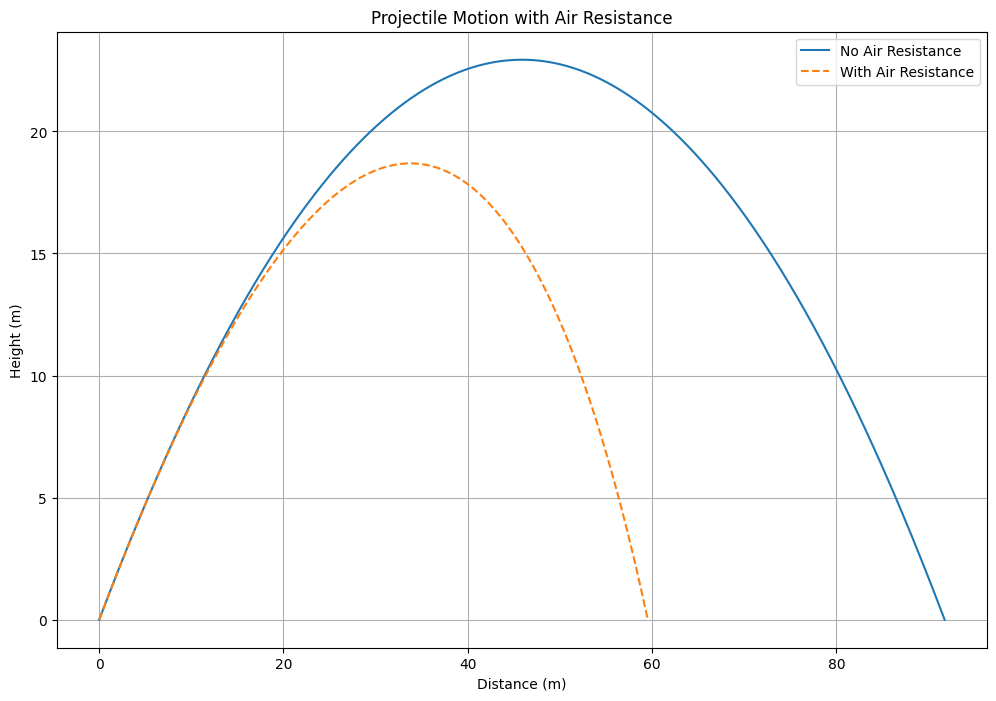

### Varying Gravitational Fields

On different planets or celestial bodies, the gravitational acceleration \( g \) varies. This affects the range and trajectory of projectiles. For instance, on the Moon, where gravity is about 1/6th of Earth's, a projectile will travel much farther for the same initial velocity and angle.

- **Equation Adjustment:** The range equation can be adjusted for different gravitational fields:

  $$
  R = \frac{v_0^2 \cdot \sin(2\theta)}{g_{\text{body}}}
  $$

  where \( g_{\text{body}} \) is the gravitational acceleration on the celestial body.

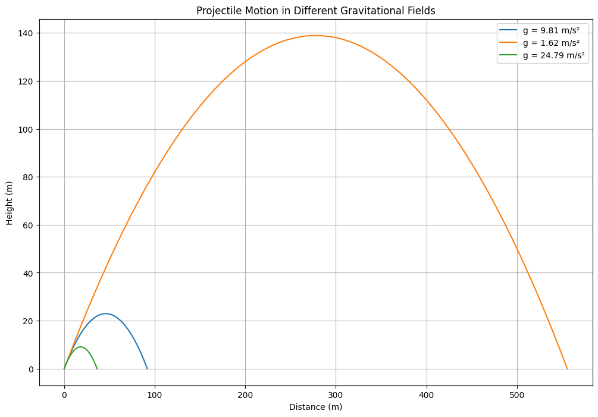

## 3. Real-World Examples

### Sports

In sports like golf, football, or basketball, understanding projectile motion is crucial for optimizing performance. Players and coaches use principles of projectile motion to improve accuracy and distance.

### Military and Aerospace

Projectile motion principles are applied in the military for targeting and launching projectiles. In aerospace, understanding how objects move through different gravitational fields is essential for mission planning and execution.

### Engineering and Construction

Engineers use projectile motion models to design structures and systems that involve moving objects, such as roller coasters or water fountains.

## 4. Conclusion

The basic model of projectile motion provides a valuable framework for understanding how objects move through space. By adapting this model to account for real-world factors such as uneven terrain, air resistance, and varying gravitational fields, we can better predict and optimize the behavior of projectiles in diverse applications.
# Implementation

## 1. Introduction

The objective is to develop a computational tool or algorithm to simulate projectile motion. This tool will allow us to explore how the range of a projectile varies with the angle of projection under different initial conditions. By varying parameters such as initial velocity and gravitational acceleration, we can gain insights into the dynamics of projectile motion.

## 2. Theoretical Foundation

### Equations of Motion

Projectile motion is governed by the following equations, assuming no air resistance and a constant gravitational field:

- **Horizontal motion:**

  $$ 
  x(t) = v_0 \cdot \cos(\theta) \cdot t 
  $$

- **Vertical motion:**

  $$ 
  y(t) = v_0 \cdot \sin(\theta) \cdot t - \frac{1}{2}gt^2 
  $$

The horizontal range \( R \) of the projectile, which is the total horizontal distance traveled, is given by:

$$ 
R = \frac{v_0^2 \cdot \sin(2\theta)}{g} 
$$

where:
- \( v_0 \) is the initial velocity,
- \( \theta \) is the angle of projection,
- \( g \) is the acceleration due to gravity.

## 3. Computational Tool

### Algorithm Design

The algorithm will simulate projectile motion by calculating the range for a set of angles and initial conditions. The steps are as follows:

1. **Define Parameters:**
   - Initial velocities: A list of different initial velocities to explore.
   - Gravitational acceleration: A constant value, typically 9.81 m/s² for Earth.
   - Angles: A range of angles from 0 to 90 degrees.

2. **Convert Angles to Radians:**
   - Since trigonometric functions in Python use radians, convert the angles from degrees to radians.

3. **Calculate Range:**
   - For each combination of initial velocity and angle, calculate the range using the formula \( R = \frac{v_0^2 \cdot \sin(2\theta)}{g} \).

4. **Store Results:**
   - Store the calculated ranges for each set of initial conditions for later visualization.

### Python Implementation

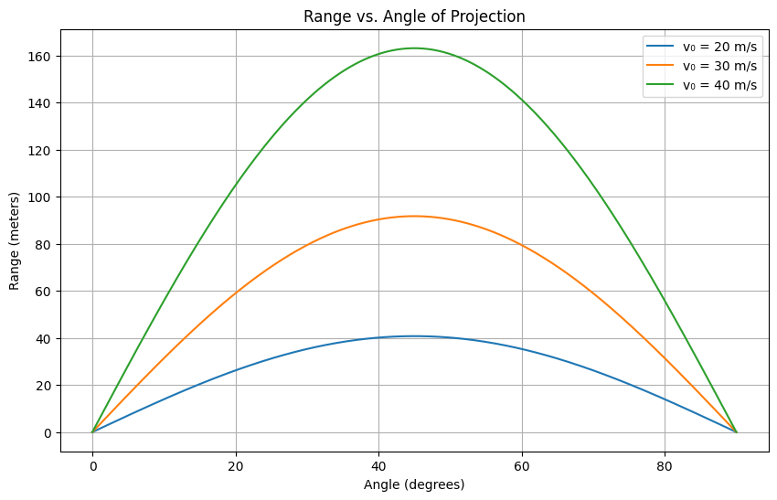

### Explanation of the Code

1. **Function Definition:**
   - `simulate_projectile_motion(v0, g, angles)`: This function calculates the range for a given initial velocity, gravitational acceleration, and set of angles. It returns an array of ranges corresponding to each angle.

2. **Parameters:**
   - `initial_velocities`: A list of different initial velocities to simulate. This allows us to explore how changes in initial velocity affect the range.
   
   - `g`: Gravitational acceleration, set to 9.81 m/s², which is the standard value on Earth.
   
   - `angles`: An array of angles from 0 to 90 degrees, providing a comprehensive view of how the range changes with angle.

3. **Simulation:**
   - For each initial velocity, the function calculates the range for each angle and stores the results in a dictionary for later analysis and visualization.

## 4. Conclusion

This computational tool provides a framework for simulating projectile motion under various initial conditions. By adjusting parameters such as initial velocity and gravitational acceleration, we can explore a wide range of scenarios and gain a deeper understanding of the factors influencing projectile motion. The results can be visualized to provide insights into the optimal conditions for maximizing range.
# Implementation

## 1. Introduction

The objective is to develop a computational tool or algorithm to simulate projectile motion. This tool will allow us to explore how the range of a projectile varies with the angle of projection under different initial conditions. By varying parameters such as initial velocity and gravitational acceleration, we can gain insights into the dynamics of projectile motion.

## 2. Theoretical Foundation

### Equations of Motion

Projectile motion is governed by the following equations, assuming no air resistance and a constant gravitational field:

- **Horizontal motion:**

  $$ 
  x(t) = v_0 \cdot \cos(\theta) \cdot t 
  $$

- **Vertical motion:**

  $$ 
  y(t) = v_0 \cdot \sin(\theta) \cdot t - \frac{1}{2}gt^2 
  $$

The horizontal range \( R \) of the projectile, which is the total horizontal distance traveled, is given by:

$$ 
R = \frac{v_0^2 \cdot \sin(2\theta)}{g} 
$$

where:
- \( v_0 \) is the initial velocity,
- \( \theta \) is the angle of projection,
- \( g \) is the acceleration due to gravity.

## 3. Computational Tool

### Algorithm Design

The algorithm will simulate projectile motion by calculating the range for a set of angles and initial conditions. The steps are as follows:

1. **Define Parameters:**
   - Initial velocities: A list of different initial velocities to explore.
   - Gravitational acceleration: A constant value, typically 9.81 m/s² for Earth.
   - Angles: A range of angles from 0 to 90 degrees.

2. **Convert Angles to Radians:**
   - Since trigonometric functions in Python use radians, convert the angles from degrees to radians.

3. **Calculate Range:**
   - For each combination of initial velocity and angle, calculate the range using the formula \( R = \frac{v_0^2 \cdot \sin(2\theta)}{g} \).

4. **Store Results:**
   - Store the calculated ranges for each set of initial conditions for later visualization.

### Explanation of the Code

1. **Function Definition:**
   - `simulate_projectile_motion(v0, g, angles)`: This function calculates the range for a given initial velocity, gravitational acceleration, and set of angles. It returns an array of ranges corresponding to each angle.

2. **Parameters:**
   
   - `initial_velocities`: A list of different initial velocities to simulate. This allows us to explore how changes in initial 
   velocity affect the range.

   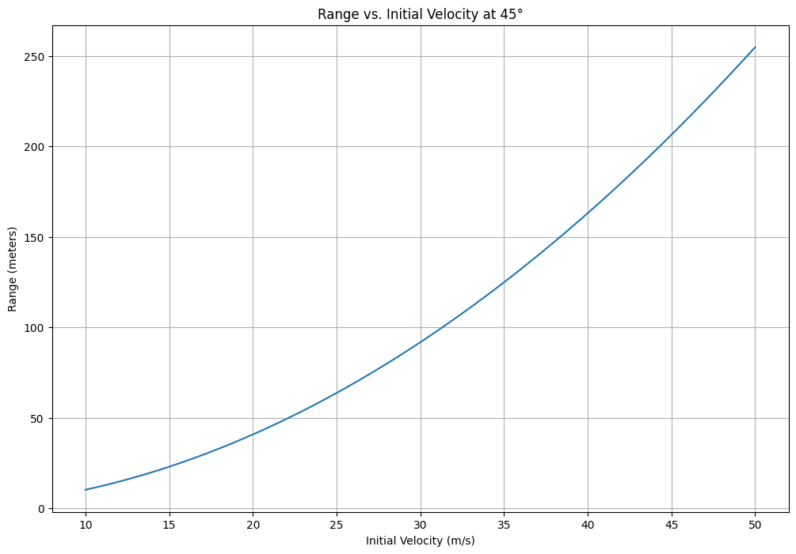

   - `g`: Gravitational acceleration, set to 9.81 m/s², which is the standard value on Earth.
   
   - `angles`: An array of angles from 0 to 90 degrees, providing a comprehensive view of how the range changes with angle.

3. **Simulation:**
   - For each initial velocity, the function calculates the range for each angle and stores the results in a dictionary for later analysis and visualization.

## 4. Conclusion

This computational tool provides a framework for simulating projectile motion under various initial conditions. By adjusting parameters such as initial velocity and gravitational acceleration, we can explore a wide range of scenarios and gain a deeper understanding of the factors influencing projectile motion. The results can be visualized to provide insights into the optimal conditions for maximizing range.