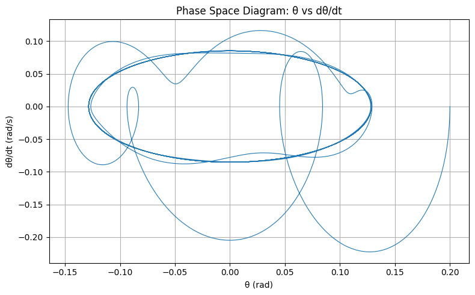
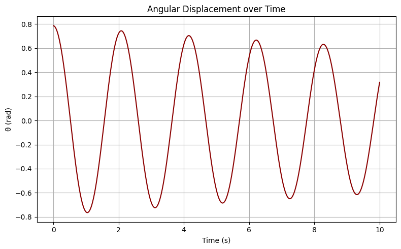
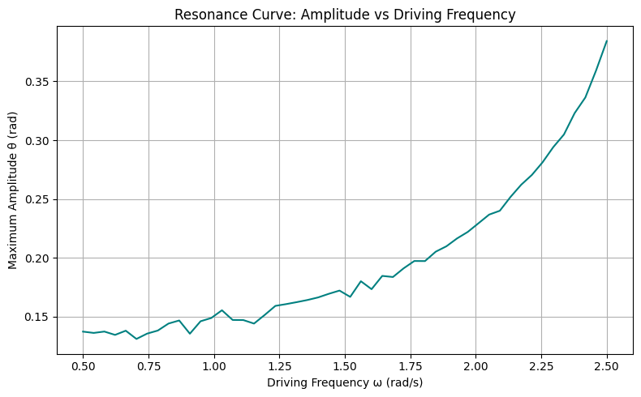
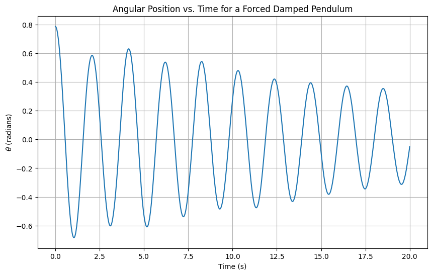
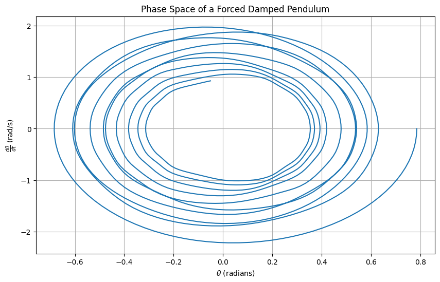
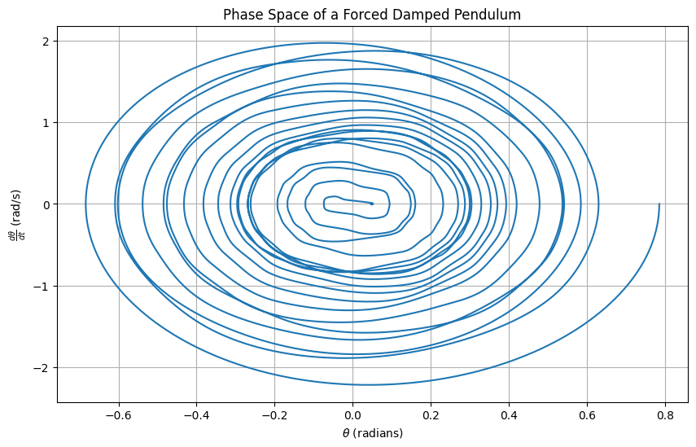
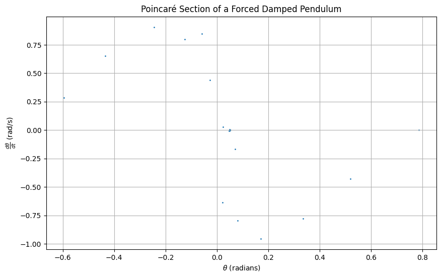

# Problem 2 

# Investigating the Dynamics of a Forced Damped Pendulum

## 1. Theoretical Foundation

The motion of a forced damped pendulum is governed by a second-order nonlinear differential equation that incorporates damping and external forcing effects.

### Governing Equation

The differential equation describing the angular displacement  $$\theta$$ of the pendulum is given by:

$$
\frac{d^2\theta}{dt^2} + b\frac{d\theta}{dt} + \frac{g}{L} \sin \theta = A \cos(\omega t)
$$

where:
- $$\theta(t)$$
 Angular displacement as a function of time  
- $$b$$
 Damping coefficient  
- $$\frac{g}{L}$$
 Term representing gravitational acceleration over pendulum length  
- $$A$$
 Amplitude of the external driving force  
- $$\omega$$
 Angular frequency of the driving force

### Small-Angle Approximation

For small angular displacements, the nonlinear term can be approximated as:

$$
\sin \theta \approx \theta
$$

This leads to the linearized equation:

$$
\frac{d^2\theta}{dt^2} + b\frac{d\theta}{dt} + \frac{g}{L} \theta = A \cos(\omega t)
$$

This simplification allows analytical techniques to be applied for understanding the system’s behavior.

### Phase Space Representation

### General Solution

The general solution is the sum of the transient and steady-state components:

$$
\theta(t) = \theta_{\text{hom}}(t) + \theta_{\text{part}}(t)
$$

 $$\theta_{\text{hom}}(t)$$

 Homogeneous (transient) solution, describing natural damping  

 $$\theta_{\text{part}}(t)$$

 Particular (steady-state) solution, describing forced response
### Numerical Results
 
It shows how the angular position of the system changes with time. It shows the effect of damping and coercive force on the system.
### Resonance Conditions

Resonance occurs when the driving frequency \( omega \) approaches the natural frequency of the system:

$$
\omega_0 = \sqrt{\frac{g}{L}}
$$

At or near resonance:

- The amplitude of oscillations increases significantly.
- Energy transfer from the driving force to the pendulum is maximized.
- System behavior may become unstable if damping is low.

Understanding resonance is essential in designing systems where oscillatory behavior must be controlled or optimized.

 

This graph visualizes the resonant response of the system. If the drag force is low, there will be a sudden increase in the resonant frequency.

 ---
# Investigating the Dynamics of a Forced Damped Pendulum

## Analysis of Dynamics

In this analysis, we explore how the damping coefficient, driving amplitude, and driving frequency influence the motion of a forced damped pendulum. We also examine the transition between regular and chaotic motion and their physical interpretations.

### Theoretical Background

The equation of motion for a forced damped pendulum is given by:

$$
\frac{d^2\theta}{dt^2} + b\frac{d\theta}{dt} + \frac{g}{L}\sin(\theta) = A\cos(\omega t)
$$

where:
- $$\theta$$ 
is the angular displacement,
- $$b$$
 is the damping coefficient,
- $$g$$
 is the acceleration due to gravity,
- $$L$$
 is the length of the pendulum,
- $$A$$
 is the driving amplitude,
- $$\omega$$
 is the driving frequency.

### Key Parameters

1. **Damping Coefficient ($$b$$):**
   - Represents the resistance to motion.
   - Higher values lead to quicker energy dissipation.
   - Influences how quickly the pendulum stabilizes.

2. **Driving Amplitude ($$A$$):**
   - Determines the external force applied to the pendulum.
   - Larger amplitudes can introduce more energy, potentially leading to chaotic behavior.

3. **Driving Frequency ($$\omega$$):**
   - The rate at which the external force is applied.
   - Can resonate with the pendulum's natural frequency, causing large oscillations.

### Dynamics and Behavior

- **Regular Motion:**
  - Characterized by predictable, periodic oscillations.
  - Occurs when parameters are set within certain stable ranges.

- **Chaotic Motion:**
  - Appears random and is highly sensitive to initial conditions.
  - Can be induced by increasing the driving amplitude or frequency.

### Transition Between Regular and Chaotic Motion

The transition from regular to chaotic motion can be observed by varying the driving amplitude and frequency. This transition is a hallmark of nonlinear dynamic systems and provides insight into the complex behavior of seemingly simple systems.

### Conclusion

The forced damped pendulum is a rich system for studying nonlinear dynamics. By adjusting parameters such as the damping coefficient, driving amplitude, and driving frequency, we can explore a wide range of behaviors from regular oscillations to chaotic motion. This analysis provides a foundation for understanding the intricate dynamics of forced damped systems.
# Practical Applications

The forced damped pendulum model is not just a theoretical construct; it has numerous real-world applications. Here, we discuss some scenarios where this model is applicable, such as in energy harvesting devices, suspension bridges, and oscillating circuits.

## Energy Harvesting Devices

Energy harvesting devices often utilize the principles of a forced damped pendulum to convert mechanical energy into electrical energy. These devices can be found in:

- **Vibration Energy Harvesters:**
  - These devices capture ambient vibrations and convert them into usable electrical energy.
  - The damping coefficient ($$b$$) and driving amplitude ($$A$$) are crucial for optimizing energy conversion efficiency.

- **Piezoelectric Generators:**
  - Utilize the mechanical stress from pendulum motion to generate electricity.
  - The driving frequency ($$\omega$$) can be tuned to match the natural frequency of the piezoelectric material for maximum efficiency.

## Suspension Bridges

Suspension bridges can be modeled as forced damped pendulums to analyze their dynamic response to external forces such as wind and traffic loads.

- **Wind-Induced Oscillations:**
  - The driving amplitude ($$A$$) represents the force exerted by the wind.
  - Engineers must ensure that the driving frequency ($$\omega$$) does not resonate with the bridge's natural frequency to prevent catastrophic failures.

- **Traffic Loads:**
  - The damping coefficient ($$b$$) is essential for dissipating energy and maintaining structural stability.

## Oscillating Circuits

In electronics, oscillating circuits can be modeled using the forced damped pendulum analogy to understand their behavior under various conditions.

- **RLC Circuits:**
  - The resistance, inductance, and capacitance in an RLC circuit can be analogous to the damping coefficient ($$b$$), driving amplitude ($$A$$), and driving frequency ($$\omega$$) in a pendulum.
  - These circuits are used in filters, tuners, and oscillators.

- **Signal Processing:**
  - Understanding the forced damped pendulum model helps in designing circuits that can handle varying signal frequencies without distortion.

## Conclusion

The forced damped pendulum model provides valuable insights into the behavior of various systems under external forces. By adjusting parameters such as the damping coefficient, driving amplitude, and driving frequency, engineers and scientists can optimize the performance and stability of these systems in real-world applications.

# Implementation

In this section, we will create a computational model to simulate the motion of a forced damped pendulum. We will explore the behavior under various damping, driving force, and initial conditions. Additionally, we will plot phase diagrams and Poincaré sections to illustrate transitions to chaos.

### Theoretical Background

The motion of a forced damped pendulum is described by the following differential equation:

$$
\frac{d^2\theta}{dt^2} + b\frac{d\theta}{dt} + \frac{g}{L}\sin(\theta) = A\cos(\omega t)
$$

where:
- $$\theta$$ 
is the angular displacement,
- $$b$$
 is the damping coefficient,
-$$g$$
 is the gravitational acceleration,
- $$L$$
 is the length of the pendulum,
- $$A$$
 is the driving force amplitude,
- $$\omega$$
 is the driving frequency.

### Computational Model

1. **Define Parameters:**
   - **Damping Coefficient ($$b$$):** Controls the rate of energy loss.
   - **Driving Amplitude ($$A$$):** Determines the strength of the external force.
   - **Driving Frequency ($$\omega$$):** Sets the rate at which the external force is applied.

2. **Initial Conditions:**
   - Set initial angular displacement and velocity to explore different dynamic behaviors.

3. **Numerical Integration:**
   - Use numerical methods to solve the differential equation over a specified time span.

4. **Visualization:**
   - **Phase Diagrams:** Plot $$\theta$$ vs. $$\frac{d\theta}{dt}$$ to observe the system's behavior.

   

   - **Poincaré Sections:** Sample the phase space at regular intervals to identify periodic and chaotic behavior.
   
   

### Analysis

- **Regular Motion:** Characterized by predictable, periodic oscillations.
- **Chaotic Motion:** Appears random and is highly sensitive to initial conditions.
- **Transition to Chaos:** By varying parameters such as \(b\), \(A\), and \(\omega\), observe how the system transitions from regular to chaotic motion.

### Conclusion

The forced damped pendulum is a rich system for studying nonlinear dynamics. By adjusting parameters and initial conditions, we can explore a wide range of behaviors from regular oscillations to chaos. This analysis provides insights into the complex dynamics of forced damped systems.