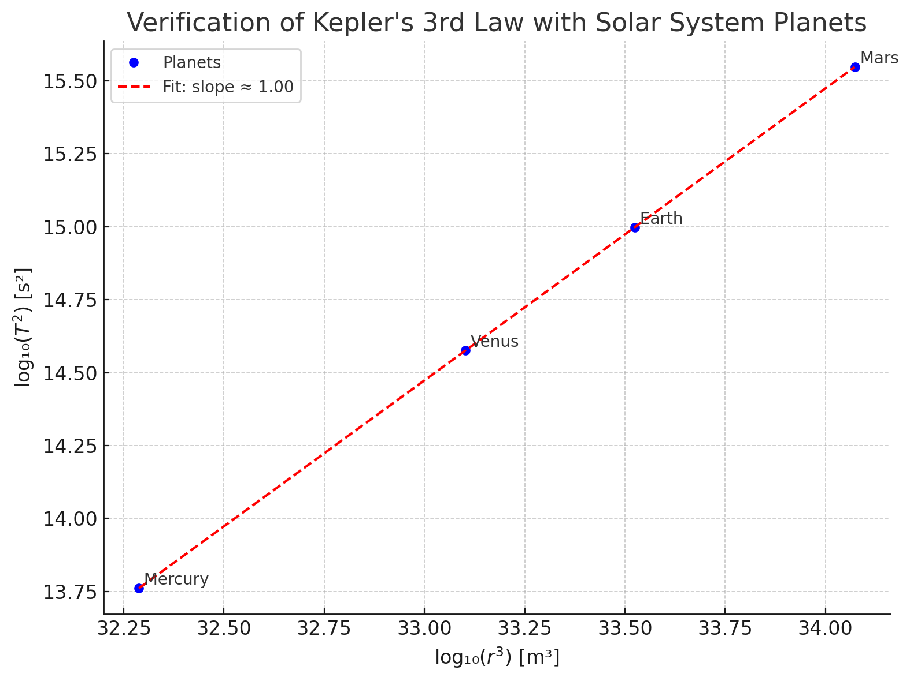
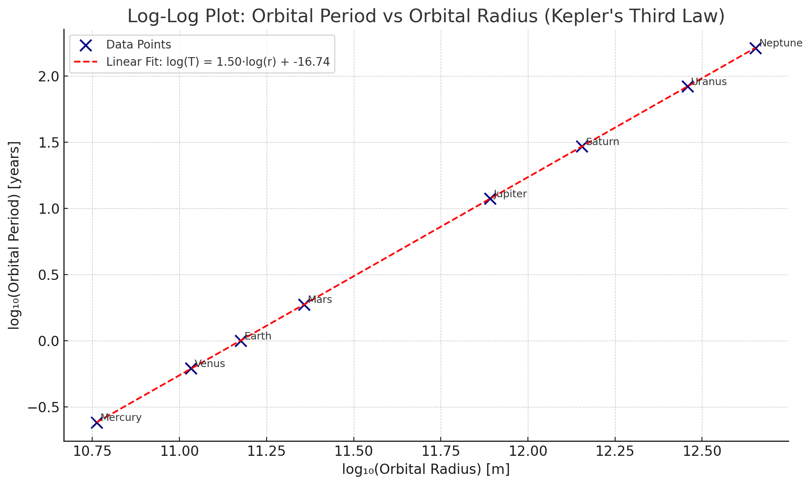
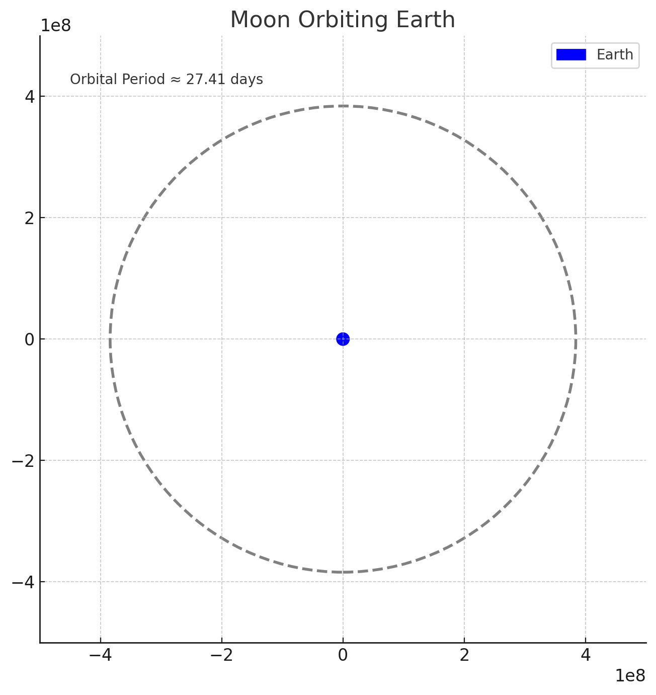
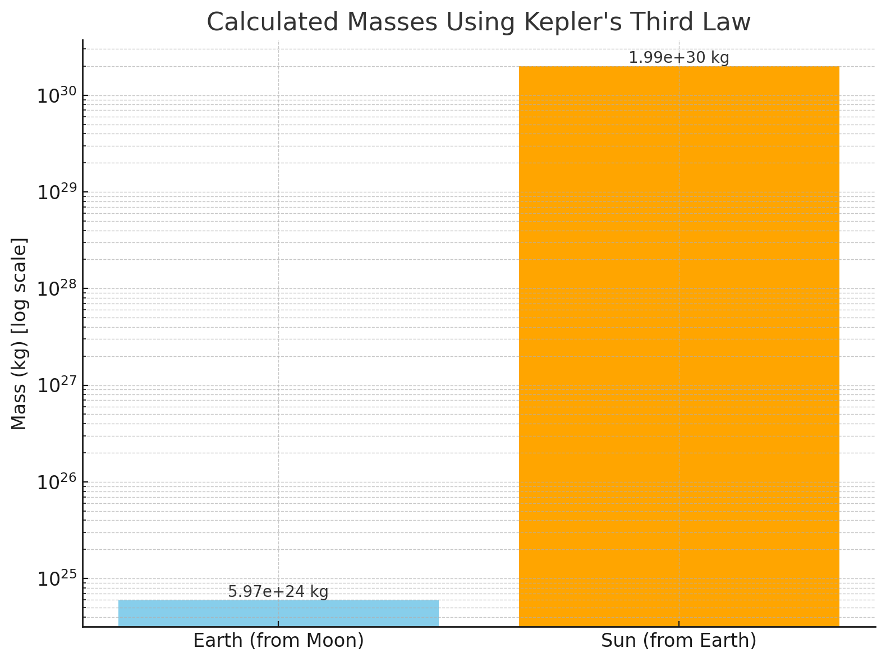
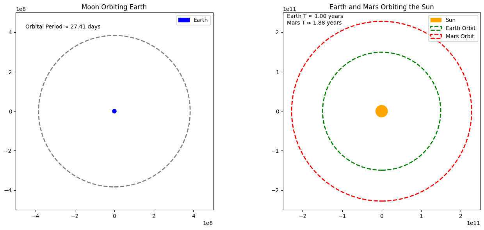

# Problem 1
# 🌍 Orbital Period and Orbital Radius: Kepler's Third Law Derivation

In a circular orbit, a body (like a planet or satellite) revolves around a much more massive object (like the Sun or Earth). The gravitational force provides the necessary **centripetal force** to maintain the orbit.

We aim to derive the relationship:

$$
T^2 \propto r^3
$$

This is known as **Kepler’s Third Law** for circular orbits.

---

## 1. Gravitational Force Acting on the Orbiting Body

According to **Newton’s Law of Universal Gravitation**, the gravitational force between two bodies is:

$$
F_g = \frac{G M m}{r^2}
$$

- \( G \): Gravitational constant  
- \( M \): Mass of the central body (e.g., the Sun)  
- \( m \): Mass of the orbiting body (e.g., a planet)  
- \( r \): Orbital radius (distance between the two centers)

---

## 2. Centripetal Force Required for Circular Motion

For circular motion, the required **centripetal force** is:

$$
F_c = \frac{m v^2}{r}
$$

- \( v \): Orbital speed of the smaller body

---

## 3. Equating Gravitational and Centripetal Forces

In a stable circular orbit:

$$
F_g = F_c
$$

Substituting:

$$
\frac{G M m}{r^2} = \frac{m v^2}{r}
$$

We can cancel the mass \( m \) (since it appears on both sides and is not zero):

$$
\frac{G M}{r^2} = \frac{v^2}{r}
$$

Multiply both sides by \( r \):

$$
\frac{G M}{r} = v^2
$$

---

## 4. Express Orbital Speed in Terms of Orbital Period

Orbital period \( T \) is the time it takes to complete one full orbit. The circumference of the orbit is \( 2\pi r \), and speed is distance over time:

$$
v = \frac{2\pi r}{T}
$$

Now square both sides:

$$
v^2 = \left( \frac{2\pi r}{T} \right)^2 = \frac{4\pi^2 r^2}{T^2}
$$

---

## 5. Equating the Two Expressions for \( v^2 \)

From earlier:

$$
v^2 = \frac{G M}{r} \quad \text{and} \quad v^2 = \frac{4\pi^2 r^2}{T^2}
$$

Set them equal:

$$
\frac{G M}{r} = \frac{4\pi^2 r^2}{T^2}
$$

---

## 6. Solve for Orbital Period \( T \)

Multiply both sides by \( T^2 \) and then by \( r \):

$$
G M T^2 = 4\pi^2 r^3
$$

Now solve for \( T^2 \):

$$
T^2 = \frac{4\pi^2}{G M} \cdot r^3
$$

---

## ✅ Final Relationship

We conclude:

$$
T^2 \propto r^3
$$

This means that **the square of the orbital period is proportional to the cube of the orbital radius**, assuming the orbit is circular and the mass of the central body is much larger than that of the orbiting body.

This is the **mathematical form of Kepler’s Third Law**, and it holds true for many orbital systems in astronomy, especially where circular approximation is valid.

---

## Orbital Period and Orbital Radius: Astronomical Implications

The relationship between the **orbital period** \( T \) and the **orbital radius** \( r \) of celestial bodies in circular orbits is elegantly captured by **Kepler’s Third Law**, which states:

$$
T^2 \propto r^3
$$

or, when expressed with a constant of proportionality that includes the gravitational constant \( G \) and the mass of the central body \( M \):

$$
T^2 = \frac{4\pi^2}{G M} r^3
$$

This simple yet powerful equation has numerous critical applications in astronomy and astrophysics. Below, we discuss the most important implications.

---

### 🔭 1. Determining Planetary Masses

Rearranging the above formula allows astronomers to **calculate the mass of a central body** (such as a planet or star) if the orbital radius and period of a satellite or planet are known:

$$
M = \frac{4\pi^2 r^3}{G T^2}
$$

This is especially useful for determining the mass of:

- The Sun, based on Earth's orbital radius and period
- Planets, by observing the orbits of their moons (e.g., Jupiter’s Galilean moons)
- Exoplanets or stars in binary systems

✅ **Example**: By observing a moon orbiting Jupiter, astronomers can compute Jupiter’s mass without ever sending a probe there.

---

### 📐 2. Estimating Distances in Space

Kepler's Third Law enables astronomers to **calculate distances** between objects in the solar system. For instance, if the orbital period of a newly discovered object is known, its distance from the Sun can be estimated:

$$
r = \left( \frac{G M T^2}{4\pi^2} \right)^{1/3}
$$

This is fundamental in:

- Charting the orbits of asteroids and comets
- Predicting satellite orbits
- Mapping the layout of planetary systems

🛰️ **In satellite dynamics**, engineers use this law to place satellites at specific orbits (e.g., geostationary orbit).

---

### 🌌 3. Understanding Star Systems and Exoplanets

In binary star systems or systems with exoplanets, the gravitational effect on a visible star allows us to apply Kepler’s Law to infer the **presence and mass of unseen companions**.

- The orbital characteristics of stars wobbling due to planets can be modeled using this law.
- It supports **radial velocity** and **transit** methods in exoplanet discovery.

🌟 **Kepler Space Telescope** used this principle extensively to find thousands of exoplanets.

---

### 🔁 4. Validation of Gravitational Theories

Kepler’s Third Law, when derived from Newton’s Law of Gravitation, serves as a bridge between **classical mechanics** and **observational astronomy**.

It confirms that:

- Gravitational force governs orbital motion
- The laws are consistent across different celestial systems

!

📊 **Observational data** from planets and moons show extraordinary agreement with the \( T^2 \propto r^3 \) relationship, strengthening our understanding of gravitational physics.

---

Its enduring relevance reminds us of the deep harmony between **mathematics** and the **universe**.
 
---

## 🌕 Example 1: The Moon Orbiting the Earth

### Known Values:
- Average orbital radius of the Moon:  
  $$ r = 3.84 \times 10^8 \ \mathrm{m} $$
- Mass of Earth:  
  $$ M = 5.97 \times 10^{24} \ \mathrm{kg} $$

### Using Kepler’s Law:
$$
T^2 = \frac{4\pi^2 (3.84 \times 10^8)^3}{6.674 \times 10^{-11} \cdot 5.97 \times 10^{24}}
$$

Calculating this gives:

$$
T \approx 2.36 \times 10^6 \ \mathrm{s} \approx 27.3 \ \mathrm{days}
$$

✅ This matches the **observed orbital period** of the Moon almost exactly. This shows how Newtonian mechanics accurately predicts satellite orbits.

---

## ☀️ Example 2: Earth and Mars Orbiting the Sun

Let’s compare the orbital periods of Earth and Mars using the ratio form of Kepler’s Third Law:

$$
\left(\frac{T_1}{T_2}\right)^2 = \left(\frac{r_1}{r_2}\right)^3
$$

Let:
- \( T_1 = \) Earth's period = 1 year,
- \( r_1 = \) Earth's distance from the Sun = \(1 \ \mathrm{AU}\),
- \( r_2 = \) Mars' distance from the Sun = \(1.52 \ \mathrm{AU}\)

Plugging in:

$$
\left(\frac{T_2}{1}\right)^2 = \left(\frac{1.52}{1}\right)^3 = 3.51
\Rightarrow T_2 = \sqrt{3.51} \approx 1.87 \ \mathrm{years}
$$

✅ Again, this aligns very closely with the actual orbital period of Mars (687 days or ~1.88 years).

---

## 🔬 Scientific Insight

- These examples highlight the **predictive power** of Kepler’s Third Law.
- Once the mass of the central body is known, we can compute either the radius or the period of orbit.
- It applies across scales — from satellites like the Moon to entire planets orbiting the Sun.

---

## 🧠 Conclusion

Real-world orbital systems, such as the Moon-Earth system or planetary orbits in the Solar System, perfectly illustrate the elegance of Kepler’s Third Law:

$$
T^2 \propto r^3
$$

Whether modeling moons, planets, or satellites, this fundamental law allows scientists and engineers to predict orbital characteristics with remarkable precision.

$$
F_{\text{gravity}} = \frac{G M m}{r^2}, \quad F_{\text{centripetal}} = \frac{m v^2}{r}
$$

Setting these equal:

$$
\frac{G M m}{r^2} = \frac{m v^2}{r}
$$

Canceling mass \(m\) and solving for orbital velocity \(v\):

$$
v = \sqrt{\frac{G M}{r}}
$$

The orbital period \(T\) (time for one full orbit) is given by:

$$
T = \frac{2 \pi r}{v} = 2\pi \sqrt{\frac{r^3}{G M}}
$$

Squaring both sides:

$$
T^2 = \frac{4 \pi^2 r^3}{G M}
$$

This confirms the relationship:

$$
T^2 \propto r^3
$$

---

### 🧪 Numerical Simulation (Model Overview)

We simulate a small object in circular orbit around a massive body using the gravitational force to update velocity and position iteratively. The simulation verifies if the object's orbital period obeys the theoretical formula.