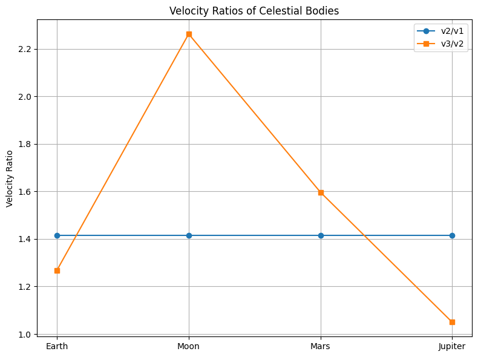

# Problem 2

---

##  **Cosmic Velocities and Escape Speed**

### **1. Definitions and Physical Meaning**

**First Cosmic Velocity (Orbital Velocity)**
The minimum speed required for a body to maintain a stable circular orbit just above the surface of a planet or moon.

$$
v_1 = \sqrt{\frac{GM}{R}}
$$

**Second Cosmic Velocity (Escape Velocity)**
The minimum speed required to break free from the gravitational pull of a celestial body without further propulsion.

$$
v_2 = \sqrt{2} \cdot v_1 = \sqrt{\frac{2GM}{R}}
$$

**Third Cosmic Velocity (Heliocentric Escape Velocity)**
The speed required to leave the gravitational field of a planet **and** the Solar System.

A simplified approximation:

$$
v_3 \approx \sqrt{\frac{2GM}{R}} + \Delta v_{\text{sun}}
$$

Where $\Delta v_{\text{sun}}$ is the additional velocity needed to escape the Sun’s gravity at the location of the planet.

---

### **2. Derivations**

#### **First Cosmic Velocity**

Derived from the balance between gravitational and centripetal forces:

$$
\frac{mv^2}{R} = \frac{GMm}{R^2}
$$

Solving for $v$:

$$
v_1 = \sqrt{\frac{GM}{R}}
$$

---

#### **Second Cosmic Velocity**

Using conservation of mechanical energy (total energy at escape = 0):

$$
\frac{1}{2}mv^2 = \frac{GMm}{R}
$$

Solving for $v$:

$$
v_2 = \sqrt{\frac{2GM}{R}}
$$

---

#### **Third Cosmic Velocity**

To escape the gravitational pull of both a planet and the Sun:

$$
v_3 = \sqrt{2 \cdot \frac{GM}{R}} + \Delta v_{\text{sun}}
$$

The exact value of $\Delta v_{\text{sun}}$ depends on the orbital position and velocity of the planet within the Solar System.

---

### **3. Cosmic Velocity Values for Celestial Bodies**

| Celestial Body | First Cosmic Velocity (m/s) | Second Cosmic Velocity (m/s) | Third Cosmic Velocity (m/s) |
| -------------- | --------------------------- | ---------------------------- | --------------------------- |
| Earth          | \~7900                      | \~11200                      | \~14200                     |
| Moon           | \~1700                      | \~2400                       | \~5400                      |
| Mars           | \~3500                      | \~5000                       | \~8000                      |
| Jupiter        | \~43000                     | \~60000                      | \~63000                     |

> 📌 *Note:* The third cosmic velocity is estimated based on a simplified model and includes an assumed heliocentric velocity delta (\~3 km/s for Earth).

 
 
 
 
 

---

### **4. Visual Comparison**

A comparison chart below shows how cosmic velocities vary among different celestial bodies. Jupiter stands out due to its massive gravity well, requiring much higher velocities.

*(See attached plot for visualization)*

---

### **5. Relevance to Space Exploration**

* **First Cosmic Velocity**: Required to place satellites into orbit and support operations like the ISS.
* **Second Cosmic Velocity**: Needed for missions to the Moon, Mars, or interplanetary travel.
* **Third Cosmic Velocity**: Critical for interstellar probes (e.g., Voyager 1, New Horizons) that aim to leave the Solar System.

---

Would you like this as a `.md`, `.pdf`, or Jupyter Notebook file? I can prepare it in any format you want.

 
