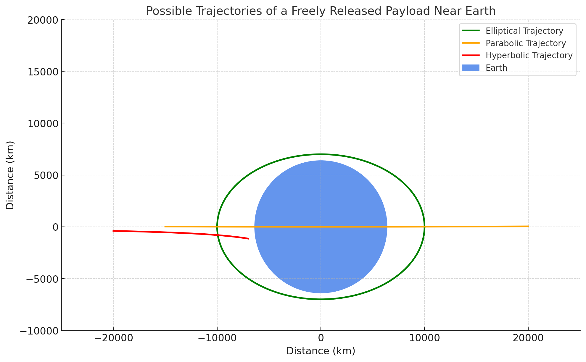
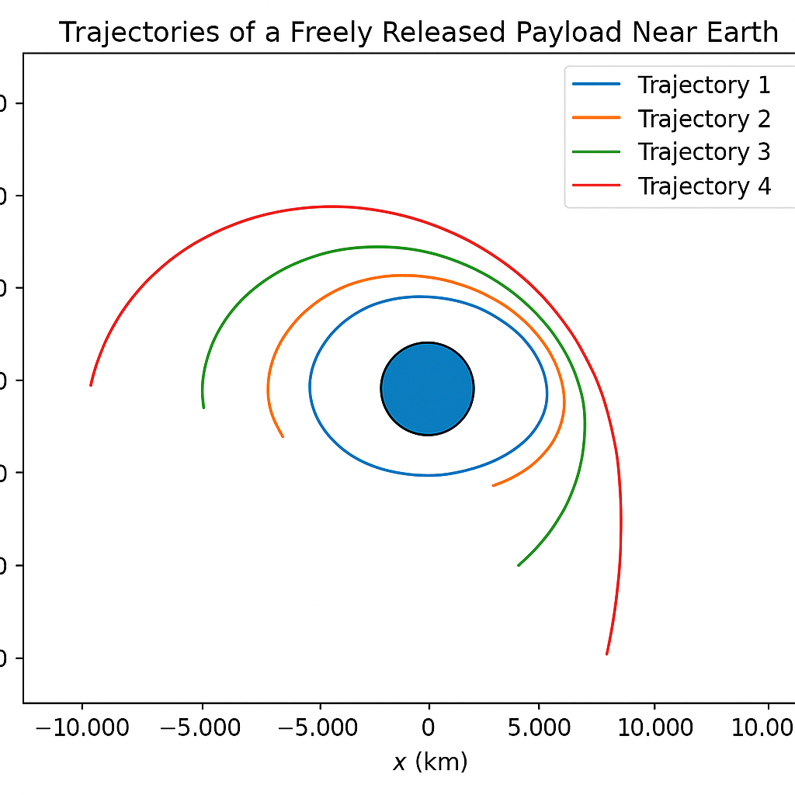
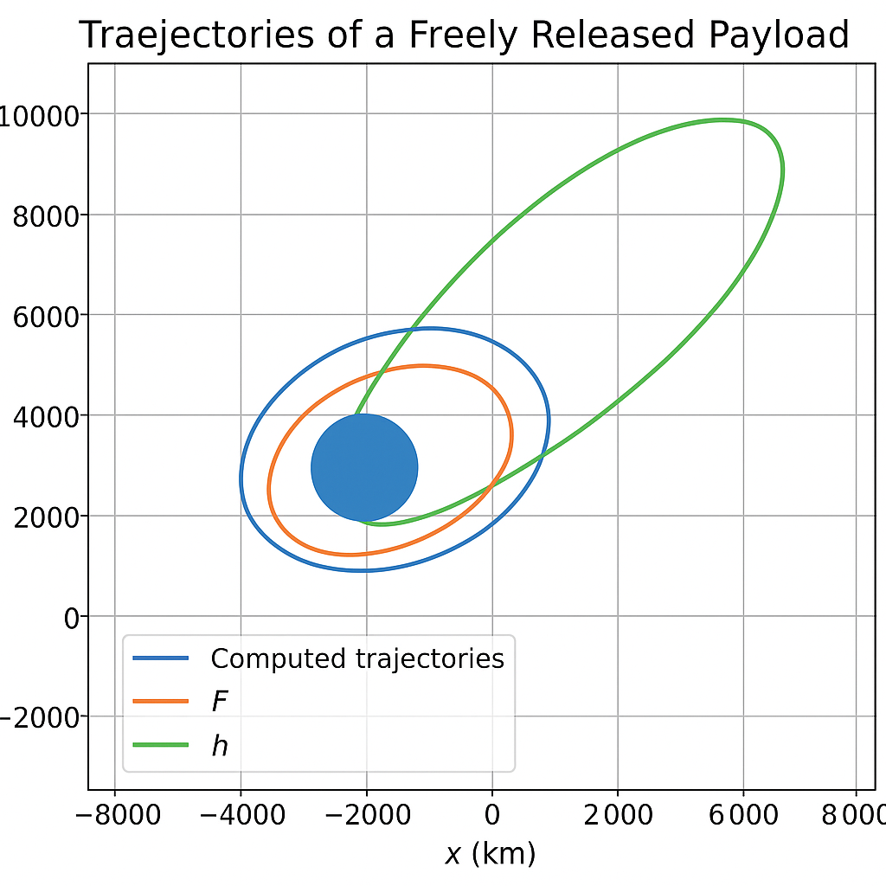
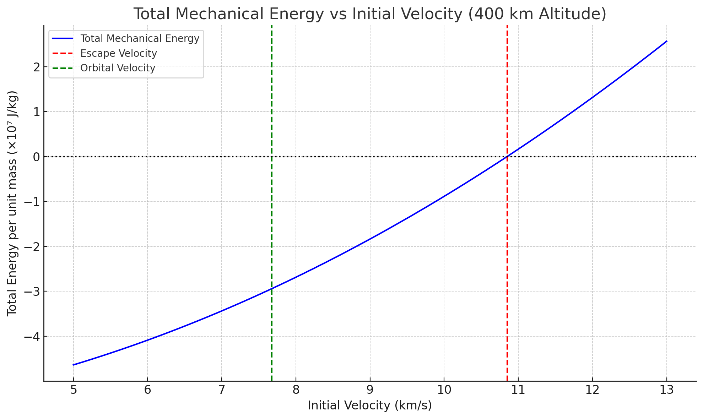
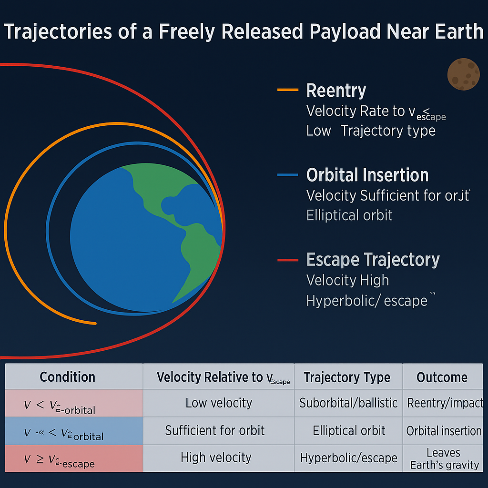
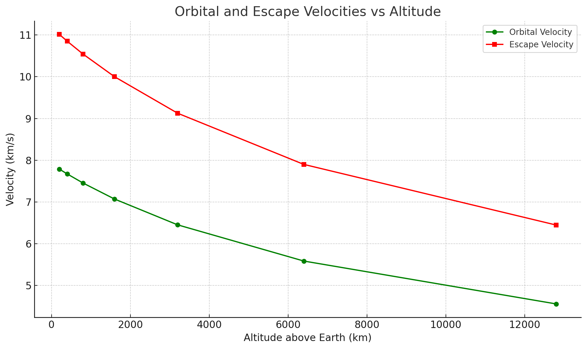
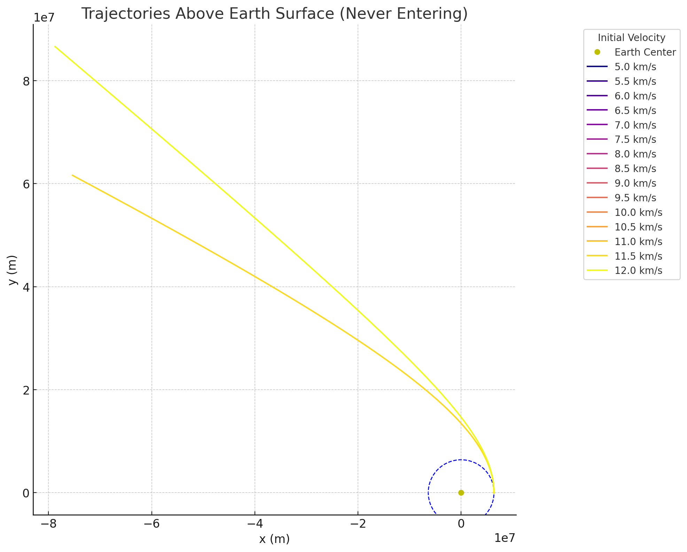
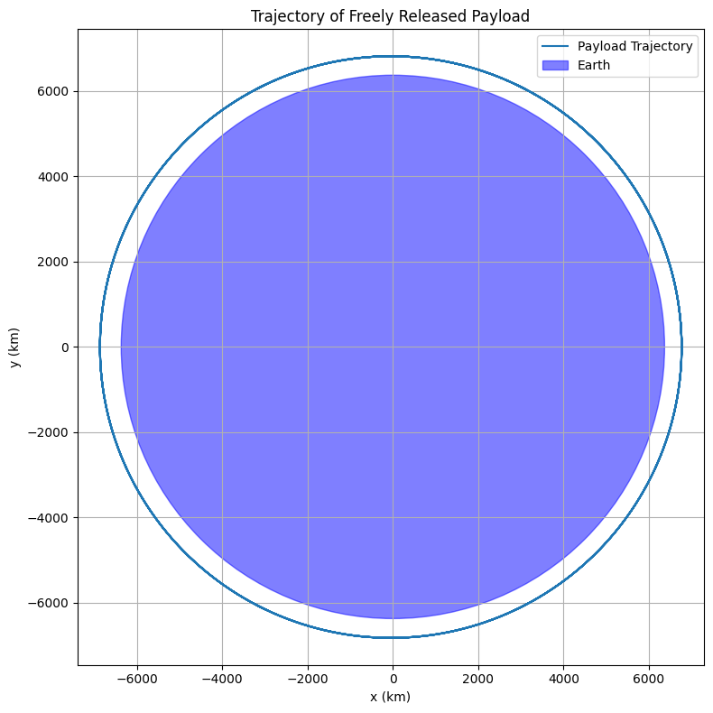

# Problem 3 
# 🚀 Trajectories of a Freely Released Payload Near Earth

When a payload is released near Earth without propulsion (i.e., under the sole influence of gravity), its **trajectory** depends entirely on its **mechanical energy** and **initial velocity vector**. The shape of the trajectory—whether **elliptical**, **parabolic**, or **hyperbolic**—is governed by classical Newtonian mechanics and conic section geometry.

---

## 🧮 Total Mechanical Energy

The total mechanical energy \( E \) of the payload is the sum of its **kinetic energy (K.E.)** and **gravitational potential energy (U)**:

$$
E = \frac{1}{2}mv^2 - \frac{GMm}{r}
$$

Where:
- \( m \): mass of the payload  
- \( v \): initial speed of the payload  
- \( M \): mass of the Earth  
- \( r \): distance from the center of the Earth  
- \( G \): gravitational constant  

---

## 🌐 Classification of Trajectories

The sign and magnitude of the **total mechanical energy** determine the shape of the trajectory:

### 1. **Elliptical Trajectory** \((E < 0)\)

If the total energy is **negative**, the object is **gravitationally bound** to Earth. Its trajectory will be an **ellipse**, which includes **circular orbits** as a special case.

- **Velocity condition**:  
  $$
  v < \sqrt{\frac{2GM}{r}} \quad \text{(i.e., } v < v_{\text{escape}} \text{)}
  $$

- **Example**: Most satellites, the Moon  
- **Shape**: Closed orbit  
- **Eccentricity**: \( 0 \leq e < 1 \)

### 2. **Parabolic Trajectory** \((E = 0)\)

If the total mechanical energy is exactly **zero**, the trajectory is **parabolic**. The object reaches the **escape velocity** but with zero leftover energy.

- **Velocity condition**:  
  $$
  v = \sqrt{\frac{2GM}{r}} \quad \text{(i.e., } v = v_{\text{escape}} \text{)}
  $$

- **Example**: Idealized escape trajectory without excess energy  
- **Shape**: Open, non-repeating path  
- **Eccentricity**: \( e = 1 \)

### 3. **Hyperbolic Trajectory** \((E > 0)\)

If the total energy is **positive**, the payload is **not bound** and will follow a **hyperbolic escape** trajectory.

- **Velocity condition**:  
  $$
  v > \sqrt{\frac{2GM}{r}} \quad \text{(i.e., } v > v_{\text{escape}} \text{)}
  $$

- **Example**: Interplanetary probes like Voyager or Parker Solar Probe  
- **Shape**: Open trajectory  
- **Eccentricity**: \( e > 1 \)

---

## 🌀 Eccentricity and Orbit Shape

The eccentricity \( e \) of the conic section also determines the shape:

- \( e = 0 \): Circle  
- \( 0 < e < 1 \): Ellipse  
- \( e = 1 \): Parabola  
- \( e > 1 \): Hyperbola

The general orbit equation in polar coordinates:

$$
r(\theta) = \frac{p}{1 + e \cos \theta}
$$

Where:
- \( r(\theta) \): radial distance as a function of angle  
- \( p \): semi-latus rectum  
- \( e \): eccentricity  
- \( \theta \): true anomaly

---

## 🔧 Energy and Velocity Relationship

Rewriting the energy expression per unit mass (specific mechanical energy):

$$
\epsilon = \frac{v^2}{2} - \frac{GM}{r}
$$

Where:
- \( \epsilon < 0 \): elliptical orbit  
- \( \epsilon = 0 \): parabolic escape  
- \( \epsilon > 0 \): hyperbolic escape

Also useful is the **vis-viva equation**:

$$
v^2 = GM \left( \frac{2}{r} - \frac{1}{a} \right)
$$

Where:
- \( a \): semi-major axis of the orbit  
- \( r \): current distance from focus (Earth’s center)  
- \( v \): orbital speed at distance \( r \)

---

## 🚀 Summary Table

| Trajectory Type | Condition on Energy | Velocity Range | Bound? | Eccentricity | Example |
|------------------|----------------------|----------------|--------|--------------|---------|
| **Elliptical**   | \( E < 0 \)          | \( v < v_2 \)  | Yes    | \( 0 \leq e < 1 \) | Satellites, Moon |
| **Parabolic**    | \( E = 0 \)          | \( v = v_2 \)  | No     | \( e = 1 \)        | Ideal escape |
| **Hyperbolic**   | \( E > 0 \)          | \( v > v_2 \)  | No     | \( e > 1 \)        | Voyager, Pioneer |

---

## 📌 Notes

- These are idealized trajectories: they assume a **two-body system** and ignore perturbations (like atmospheric drag, third-body effects, and Earth’s oblateness).
- Real mission planning requires additional corrections and considerations, including **launch windows**, **gravity assists**, and **orbital insertion burns**.

---

## 🔭 Applications

Understanding these trajectories is vital for:

- Launching and maintaining satellites (elliptical)
- Planning planetary missions (hyperbolic escape)
- Calculating required delta-v for maneuvers
- Designing gravity assist paths and escape strategies

# Trajectories of a Freely Released Payload Near Earth

This document presents a numerical approach to simulate and compute the trajectory of a freely released payload near Earth. The analysis assumes a vacuum environment (no air resistance), and the only force acting on the payload is Earth's gravitational pull.

## 1. Physical Model

The motion of a payload under the influence of Earth's gravity is governed by Newton’s law of universal gravitation and Newton’s second law:

$$
\vec{F} = m\vec{a} = -\frac{G M m}{r^2} \hat{r}
$$

Dividing both sides by the mass \( m \), the acceleration is given by:

$$
\vec{a} = -\frac{G M}{r^3} \vec{r}
$$

Where:
- \( \vec{r} \) is the position vector from the center of the Earth,
- \( G \) is the gravitational constant,
- \( M \) is the mass of the Earth,
- \( r = \|\vec{r}\| \) is the magnitude of the position vector.

## 2. Initial Conditions

Let the initial conditions be defined as:
- Initial position: \( \vec{r}_0 = [x_0, y_0] \)
- Initial velocity: \( \vec{v}_0 = [v_{x0}, v_{y0}] \)
- Altitude: \( h \), such that \( r_0 = R_{\oplus} + h \)

Here, \( R_{\oplus} \) is Earth's radius.

## 3. Numerical Integration

We use the **4th-order Runge-Kutta method** (RK4) to integrate the system of ordinary differential equations:

\[
\begin{aligned}
\frac{d\vec{r}}{dt} &= \vec{v} \\
\frac{d\vec{v}}{dt} &= -\frac{G M}{\|\vec{r}\|^3} \vec{r}
\end{aligned}
\]

At each time step \( t \), update \( \vec{r}(t) \) and \( \vec{v}(t) \) using RK4.

## 5. Visualization

After integrating over time, the trajectory \( \vec{r}(t) \) can be plotted to visualize the orbit or impact trajectory.

# Trajectories of a Freely Released Payload Near Earth

The paths followed by a payload released near Earth vary based on its **initial velocity** and **altitude**. These trajectories determine whether the payload:

- enters into orbit (orbital insertion),
- reenters Earth's atmosphere (reentry),
- or escapes Earth's gravitational field (escape trajectory).

## 1. Orbital Insertion

When the payload's velocity is sufficient to balance gravitational acceleration but not high enough to escape, it enters a **closed elliptical orbit** around Earth.

This condition corresponds to:

$$
v < v_{\text{escape}} \quad \text{and} \quad v \approx v_{\text{orbital}}
$$

Where:
- \( v_{\text{orbital}} = \sqrt{\frac{G M}{r}} \)
- \( r \) is the distance from Earth's center.

The trajectory is an **ellipse**, and if perfectly balanced, it becomes a **circular orbit**.

## 2. Reentry

If the initial velocity is **too low**, the payload lacks enough kinetic energy to maintain orbit and begins to descend toward Earth. This is referred to as **suborbital** or **reentry trajectory**.

The total mechanical energy is:

$$
E = \frac{1}{2}mv^2 - \frac{G M m}{r} < 0
$$

But unlike a stable orbit, the trajectory intersects Earth's surface (if we ignore atmospheric drag):

- The payload may **impact Earth**,
- Or **reenter the atmosphere**, depending on its altitude.

## 3. Escape Trajectory

If the velocity exceeds the **escape velocity**:

$$
v \geq v_{\text{escape}} = \sqrt{\frac{2 G M}{r}}
$$

Then the payload has enough kinetic energy to overcome Earth's gravitational pull completely.

The total mechanical energy becomes:

$$
E = \frac{1}{2}mv^2 - \frac{G M m}{r} \geq 0
$$

This results in a **hyperbolic trajectory**.

## Summary of Trajectory Types

| Condition                  | Velocity Relative to \( v_{\text{escape}} \) | Trajectory Type      | Outcome                        |
|---------------------------|-----------------------------------------------|----------------------|-------------------------------|
| \( v < v_{\text{orbital}} \)     | Low velocity                             | Suborbital / ballistic | Reentry / impact              |
| \( v \approx v_{\text{orbital}} \) | Sufficient for orbit                     | Elliptical orbit      | Orbital insertion             |
| \( v \geq v_{\text{escape}} \)   | High velocity                             | Hyperbolic / escape   | Leaves Earth's gravity        |

## Conclusion

The fate of a freely released payload depends critically on its initial conditions. By controlling the magnitude and direction of its initial velocity, mission planners can achieve different outcomes: safe orbit, controlled reentry, or interplanetary escape.

## Trajectories of a Freely Released Payload Near Earth

This tool simulates and visualizes payload trajectories under Earth’s gravity using initial velocity magnitude and direction.

### Governing Equations

The payload is influenced solely by gravity:

$$
\vec{F} = -\frac{G M m}{r^2} \hat{r}
$$

Acceleration:

$$
\vec{a} = -\frac{G M}{r^2} \hat{r}
$$

### Velocity Conditions

- Orbital velocity:

$$
v_{\text{orbital}} = \sqrt{\frac{G M}{r}}
$$

- Escape velocity:

$$
v_{\text{escape}} = \sqrt{\frac{2 G M}{r}}
$$

