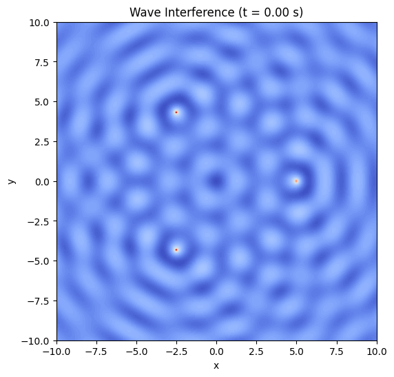
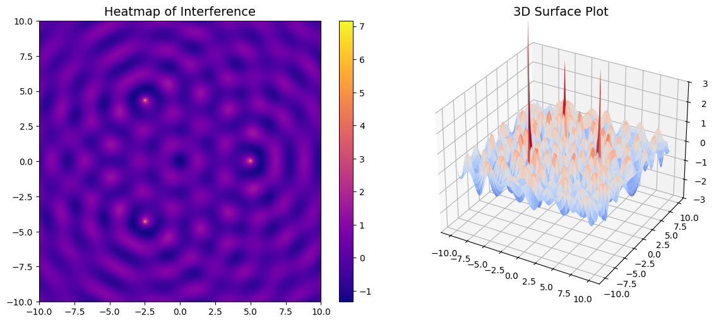

# Problem 1 

---

##  Wave Interference Simulation on a Water Surface

###  Objective

This project aims to simulate and visualize the **interference patterns** produced by waves emitted from point sources arranged in the shape of a **regular polygon** (triangle, square, pentagon, etc.) on a 2D water surface. By applying the **principle of superposition**, we can analyze how waves interact — constructively or destructively — over time and space.

---

##  Theoretical Background

###  1. Single Point Source Wave

A circular wave originating from a point source $(x_0, y_0)$ on a 2D water surface can be described by the following formula:

$$
\eta(x, y, t) = \frac{A}{\sqrt{r}} \cdot \cos(kr - \omega t + \phi)
$$

Where:

* $\eta(x, y, t)$: vertical displacement of the surface
* $A$: amplitude of the wave
* $r = \sqrt{(x - x_0)^2 + (y - y_0)^2}$: distance from the source
* $k = \frac{2\pi}{\lambda}$: wave number
* $\omega = 2\pi f$: angular frequency
* $\phi$: initial phase of the wave

###  2. Superposition Principle

When multiple waves interact, the resulting displacement is the **sum** of individual displacements:

$$
\eta_{\text{sum}}(x, y, t) = \sum_{i=1}^{N} \eta_i(x, y, t)
$$

Where $N$ is the number of wave sources (i.e., vertices of the polygon).

---

##  Simulation in Python (Google Colab)

###  Requirements

Run this code in **Google Colab**. It uses `numpy`, `matplotlib`, and `Pillow`.

```python
#  Install required packages (if not already installed)
!pip install pillow
```

###  Full Python Code

```python
import numpy as np
import matplotlib.pyplot as plt
from matplotlib import animation

# === WAVE PARAMETERS ===
A = 1.0                  # Amplitude
wavelength = 2.0         # Wavelength (lambda)
k = 2 * np.pi / wavelength  # Wave number
f = 1.0                  # Frequency
omega = 2 * np.pi * f    # Angular frequency
phi = 0.0                # Initial phase

# === GEOMETRIC PARAMETERS ===
polygon_sides = 3        # Choose 3 (triangle), 4 (square), 5 (pentagon), etc.
radius = 5               # Radius of polygon

# === SIMULATION GRID ===
x = np.linspace(-10, 10, 300)
y = np.linspace(-10, 10, 300)
X, Y = np.meshgrid(x, y)

# === TIME FRAMES FOR ANIMATION ===
frames = 60
t_vals = np.linspace(0, 2 * np.pi / omega, frames)

# === SOURCE LOCATIONS ===
angles = np.linspace(0, 2 * np.pi, polygon_sides, endpoint=False)
source_positions = [(radius * np.cos(a), radius * np.sin(a)) for a in angles]

# === PLOT SETUP ===
fig, ax = plt.subplots(figsize=(6, 6))

def update(frame):
    t = t_vals[frame]
    eta_total = np.zeros_like(X)
    
    for (x0, y0) in source_positions:
        r = np.sqrt((X - x0)**2 + (Y - y0)**2)
        eta = A / np.sqrt(r + 1e-6) * np.cos(k * r - omega * t + phi)
        eta_total += eta
    
    ax.clear()
    ax.set_title(f"Wave Interference (t = {t:.2f} s)")
    ax.set_xlabel("x")
    ax.set_ylabel("y")
    return ax.contourf(X, Y, eta_total, levels=100, cmap='coolwarm')

ani = animation.FuncAnimation(fig, update, frames=frames, blit=False)

# Save the animation
ani.save("wave_interference.gif", writer="pillow", fps=10)
```
 
 

---

##  Results and Discussion

The simulation above produces an animated **heatmap** showing the wave interference patterns.

###  Key Observations:

* **Constructive interference**: Occurs where wave crests meet crests or troughs meet troughs → bright areas.
* **Destructive interference**: Occurs where crests meet troughs → dark or flat zones.
* The **symmetry** of the polygon directly influences the shape of the interference pattern.
* As time evolves, the wave pattern dynamically shifts but preserves its symmetry due to coherence.

---

##  Conclusion

Through this simulation, we gained a visual and intuitive understanding of how **coherent wave sources** interact via superposition. This forms the basis for important physical phenomena like:

* **Diffraction patterns**
* **Sound wave interference**
* **Light wave behavior in optics**
* **Quantum wave functions**

---


