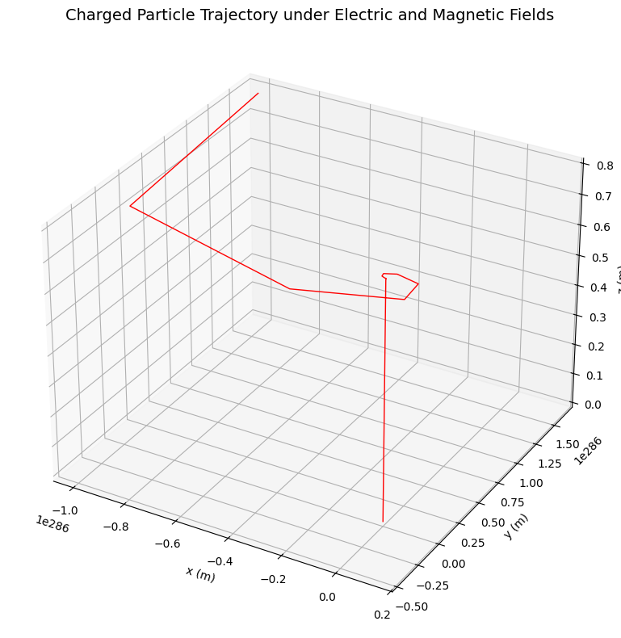
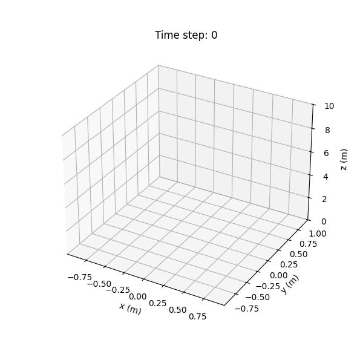
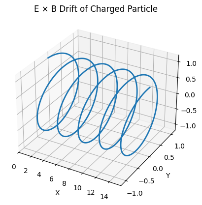
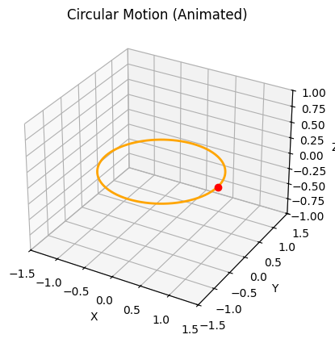
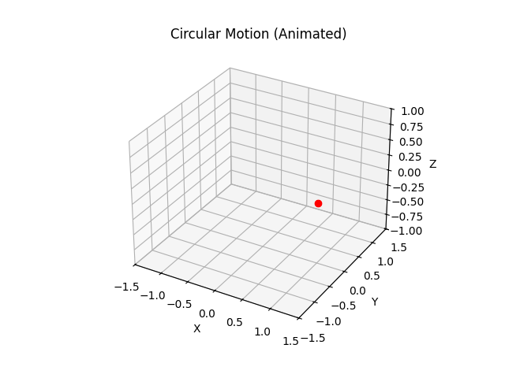
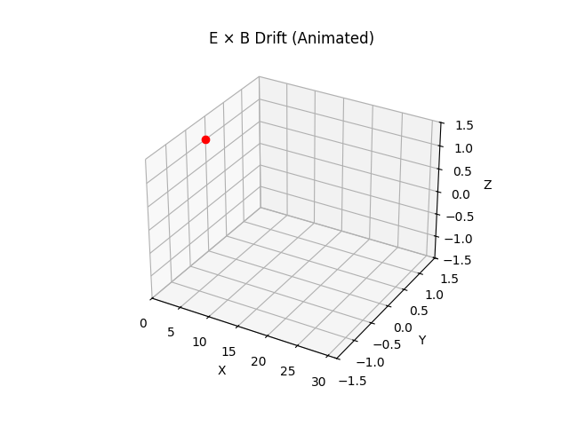

# Problem 1

---

##  **Electromagnetism: Lorentz Force Simulation**

###  **1. Motivation**

Charged particles in electric and magnetic fields experience the **Lorentz force**, given by:

$$
\\mathbf{F} = q\\mathbf{E} + q\\mathbf{v} \\times \\mathbf{B}
$$

This force dictates the motion of particles in systems such as:

* Particle accelerators (e.g., cyclotrons),
* Mass spectrometers,
* Plasma confinement in fusion reactors,
* The Earth's magnetosphere affecting solar wind particles.

Understanding this force through simulation helps us visualize phenomena such as **helical motion**, **circular orbits**, and **drift velocities**.

---

###  **2. Problem Statement**

We will simulate and visualize the trajectory of a charged particle moving under:

* Only a magnetic field (**circular or helical motion**),
* Only an electric field (**linear acceleration**),
* Both fields simultaneously (**complex motion: drift, helical**).

---

###  **3. Simulation Setup**

The equation of motion under Lorentz force is:

$$
\\mathbf{a} = \\frac{\\mathbf{F}}{m} = \\frac{q}{m}(\\mathbf{E} + \\mathbf{v} \\times \\mathbf{B})
$$

We will use the **Euler method** to integrate the equations numerically.

---

###  **4. Python Code for Google Colab**

```python
import numpy as np
import matplotlib.pyplot as plt
from mpl_toolkits.mplot3d import Axes3D

# --- Constants ---
q = 1.6e-19       # Charge of the particle (Coulombs)
m = 9.11e-31      # Mass of electron (kg)

# --- Fields ---
E = np.array([0.0, 0.0, 1e5])     # Electric field (V/m)
B = np.array([0.0, 0.0, 1.0])     # Magnetic field (T)

# --- Initial Conditions ---
r0 = np.array([0.0, 0.0, 0.0])    # Initial position (m)
v0 = np.array([1e6, 0.0, 0.0])    # Initial velocity (m/s)

# --- Time Parameters ---
dt = 1e-11        # Time step (s)
steps = 5000      # Number of iterations

# --- Arrays for position and velocity ---
r = np.zeros((steps, 3))
v = np.zeros((steps, 3))
r[0] = r0
v[0] = v0

# --- Time Integration using Euler method ---
for i in range(1, steps):
    F = q * (E + np.cross(v[i-1], B))
    a = F / m
    v[i] = v[i-1] + a * dt
    r[i] = r[i-1] + v[i] * dt

# --- Plotting the 3D trajectory ---
fig = plt.figure(figsize=(10, 8))
ax = fig.add_subplot(111, projection='3d')
ax.plot(r[:, 0], r[:, 1], r[:, 2], color='red', linewidth=1)
ax.set_title('Charged Particle Trajectory under Electric and Magnetic Fields', fontsize=14)
ax.set_xlabel('x (m)')
ax.set_ylabel('y (m)')
ax.set_zlabel('z (m)')
plt.tight_layout()
plt.show()
```

---

###  **5. Analysis of the Result**

Depending on the configuration of the fields:

* **Only magnetic field** ⇒ Circular or helical motion.
* **Only electric field** ⇒ Linear acceleration.
* **Crossed fields** ⇒ Drift in the perpendicular direction (e.g., **E × B drift**).

This simulation demonstrates a **helical path**: the electric field causes linear acceleration along the $z$-axis, while the magnetic field forces the particle into circular motion in the $x$-$y$ plane.

---

###  **6. Adding Visualization as a GIF (Bonus)**

Colab'ta çalıştırmak için:

```python
import matplotlib.animation as animation

fig = plt.figure(figsize=(6, 6))
ax = fig.add_subplot(111, projection='3d')

def update(num):
    ax.clear()
    ax.plot(r[:num, 0], r[:num, 1], r[:num, 2], color='purple')
    ax.set_xlim([np.min(r[:, 0]), np.max(r[:, 0])])
    ax.set_ylim([np.min(r[:, 1]), np.max(r[:, 1])])
    ax.set_zlim([np.min(r[:, 2]), np.max(r[:, 2])])
    ax.set_title(f'Time step: {num}')
    ax.set_xlabel('x (m)')
    ax.set_ylabel('y (m)')
    ax.set_zlabel('z (m)')

ani = animation.FuncAnimation(fig, update, frames=range(0, steps, 50), interval=20)

from IPython.display import HTML
HTML(ani.to_jshtml())
```
 
 
 



---

###  **7. Real-World Applications**

| System              | Use of Lorentz Force                          |
| ------------------- | --------------------------------------------- |
| Cyclotron           | Accelerates particles in a circular path      |
| Mass Spectrometer   | Sorts particles by charge/mass ratio          |
| Tokamak Fusion Core | Confinement of hot plasma using $B$ field     |
| Van Allen Belts     | Trapping of solar wind particles around Earth |

---

###  **8. Further Enhancements**

* Add **non-uniform fields**.
* Use **Runge-Kutta** for higher accuracy.
* Simulate **relativistic speeds**.
* Introduce **collisions or damping**.

---


