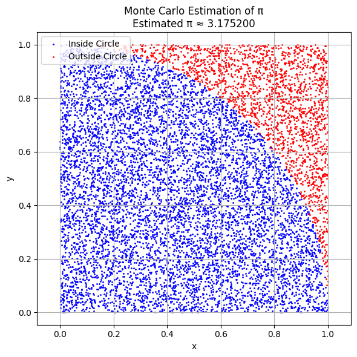
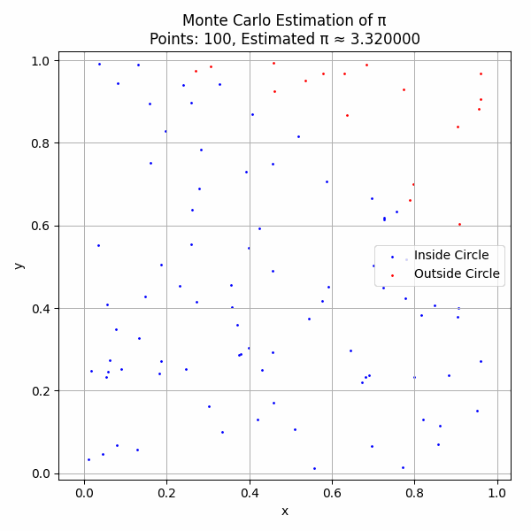
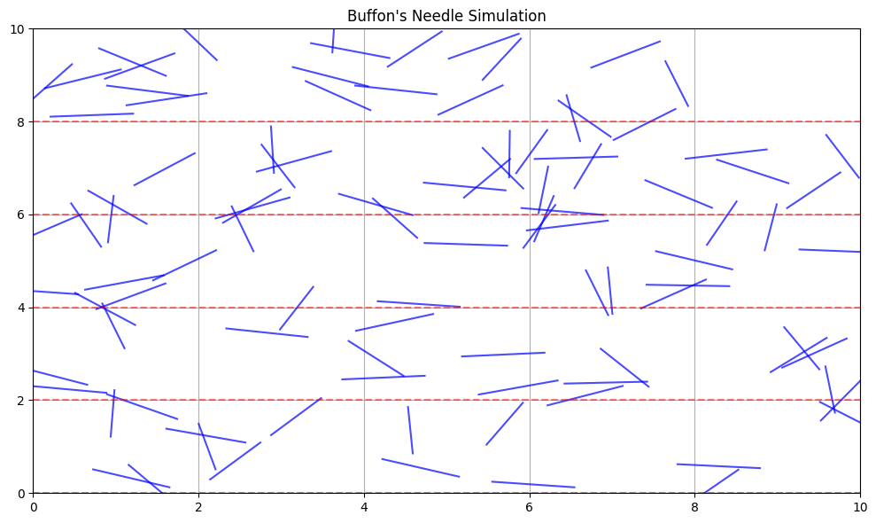
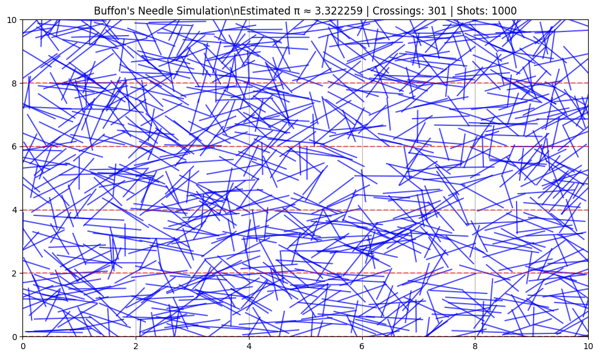
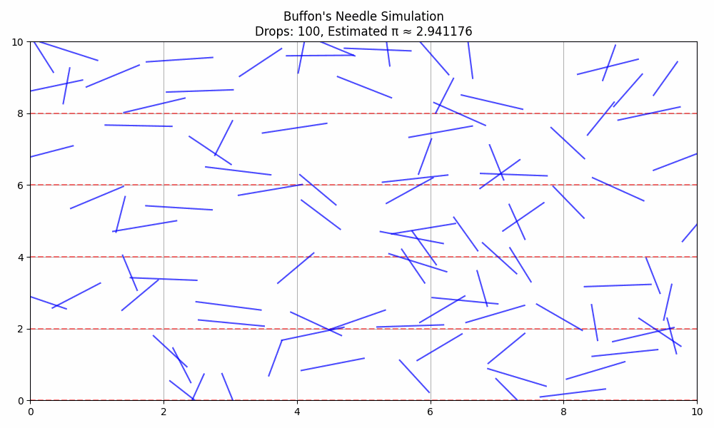

# Problem 2 

---

## 💠 **Estimating \$\pi\$ Using Monte Carlo Methods**

---

### 📌 Part 1: Estimating \$\pi\$ Using a Circle

---

### 🔹 1. Theoretical Foundation

We estimate \$\pi\$ using geometric probability. A square of side 1 has area 1, and a circle inscribed in it (radius = 1) has area:

$$
A_{\text{circle}} = \pi r^2 = \pi
$$

If we randomly throw points into the square, the probability of landing inside the circle is:

$$
P = \frac{\text{Area of Circle}}{\text{Area of Square}} = \frac{\pi}{4}
$$

So:

$$
\pi \approx 4 \cdot \frac{\text{points inside circle}}{\text{total points}}
$$

---

### 🔹 2. Python Simulation Code (for Google Colab)

```python
import numpy as np
import matplotlib.pyplot as plt

def monte_carlo_pi(n_points=10000):
    x = np.random.rand(n_points)
    y = np.random.rand(n_points)
    inside_circle = x**2 + y**2 <= 1
    pi_estimate = 4 * np.sum(inside_circle) / n_points
    return x, y, inside_circle, pi_estimate

# Run simulation
x, y, inside_circle, pi_estimate = monte_carlo_pi(10000)

# Plotting
plt.figure(figsize=(6,6))
plt.scatter(x[inside_circle], y[inside_circle], color='blue', s=1, label='Inside Circle')
plt.scatter(x[~inside_circle], y[~inside_circle], color='red', s=1, label='Outside Circle')
plt.title(f"Monte Carlo Estimation of π\nEstimated π ≈ {pi_estimate:.6f}")
plt.xlabel("x")
plt.ylabel("y")
plt.axis("equal")
plt.legend()
plt.grid(True)
plt.tight_layout()
plt.show()
```
 

---

### 🔹 3. Analysis & Convergence

As you increase the number of points $n$, the estimate gets closer to the true value of $\pi \approx 3.14159$. The error decreases as:

$$
\text{Error} \propto \frac{1}{\sqrt{n}}
$$

---

## 📏 Part 2: Estimating \$\pi\$ Using Buffon’s Needle

---

### 🔹 1. Theoretical Foundation

A needle of length $L$ is dropped on a floor with parallel lines spaced $D$ units apart (with $L \leq D$). The probability it crosses a line is:

$$
P = \frac{2L}{\pi D}
$$

Solving for $\pi$:

$$
\pi \approx \frac{2 \cdot L \cdot N}{D \cdot C}
$$

Where:

* $N$ = number of throws
* $C$ = number of crossings

---

### 🔹 2. Python Simulation Code

```python
def buffon_needle_simulation(n_drops=10000, needle_length=1.0, line_distance=2.0):
    if needle_length > line_distance:
        raise ValueError("Needle must be shorter than the line spacing.")

    theta = np.random.uniform(0, np.pi/2, n_drops)  # angle of drop
    d = np.random.uniform(0, line_distance/2, n_drops)  # distance from line center

    crosses = d <= (needle_length/2) * np.sin(theta)
    num_crosses = np.sum(crosses)

    if num_crosses == 0:
        return None, 0

    pi_estimate = (2 * needle_length * n_drops) / (line_distance * num_crosses)
    return pi_estimate, num_crosses

# Run simulation
pi_buffon, crossings = buffon_needle_simulation()
print(f"Buffon's Needle Estimate of π: {pi_buffon:.6f} with {crossings} crossings")
```
 
 

---

### 🔹 3. Needle Visualization (Bonus for Report)

```python
# Visualizing needle drops
np.random.seed(0)
n_needles = 100
x_center = np.random.uniform(0, 10, n_needles)
y_center = np.random.uniform(0, 10, n_needles)
angles = np.random.uniform(0, np.pi, n_needles)
L = 1.0

x1 = x_center - (L/2) * np.cos(angles)
y1 = y_center - (L/2) * np.sin(angles)
x2 = x_center + (L/2) * np.cos(angles)
y2 = y_center + (L/2) * np.sin(angles)

plt.figure(figsize=(10, 6))
for i in range(n_needles):
    plt.plot([x1[i], x2[i]], [y1[i], y2[i]], 'b-', alpha=0.7)

for y in np.arange(0, 11, 2):
    plt.axhline(y, color='r', linestyle='--', alpha=0.5)

plt.title(\"Buffon's Needle Simulation\")
plt.xlim(0, 10)
plt.ylim(0, 10)
plt.grid(True)
plt.tight_layout()
plt.show()
```

---

## 📊 Summary & Comparison

| Method          | Formula                                                        | Convergence Rate         | Accuracy          | Visualization       |
| --------------- | -------------------------------------------------------------- | ------------------------ | ----------------- | ------------------- |
| Circle Method   | $\\pi \\approx 4 \\cdot \\frac{\\text{inside}}{\\text{total}}$ | $O(1/\\sqrt{n})$         | Fast              | Very clear          |
| Buffon’s Needle | $\\pi \\approx \\frac{2LN}{DC}$                                | $O(1/\\sqrt{n})$, slower | Needs more trials | Visual and physical |

---


